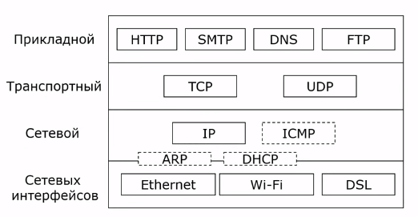

---
## Front matter
lang: ru-RU
title: Стек протоколов TCP/IP
subtitle:
author:
  - Кобзев Д. К. 
institute:
  - Российский университет дружбы народов, Москва, Россия

## i18n babel
babel-lang: russian
babel-otherlangs: english

## Pdf output format
fontsize: 8pt

## Formatting pdf
toc: false
toc-title: Содержание
slide_level: 2
aspectratio: 169
section-titles: true
theme: metropolis
##Fonts
mainfont: Liberation Serif
sansfont: Liberation Sans
monofont: Liberation Mono
---

# Информация

## Докладчик

:::::::::::::: {.columns align=center}
::: {.column width="70%"}

  * Кобзев Дмитрий Константинович
  * Студент
  * Российский университет дружбы народов
  * НПИбд-01-23

:::
::: {.column width="30%"}

:::
::::::::::::::

## TCP/IP

TCP/IP — сетевая модель передачи данных, представленных в цифровом виде. Модель описывает способ передачи данных от источника информации к получателю. В модели предполагается прохождение информации через четыре уровня, каждый из которых описывается правилом (протоколом передачи). Наборы правил, решающих задачу по передаче данных, составляют стек протоколов передачи данных, на которых базируется Интернет. Название TCP/IP происходит из двух важнейших протоколов семейства — Transmission Control Protocol (TCP) и Internet Protocol (IP), которые были первыми разработаны и описаны в данном стандарте. 

## Стек протоколов TCP/IP

Набор интернет-протоколов обеспечивает сквозную передачу данных, определяющую, как данные должны пакетироваться, обрабатываться, передаваться, маршрутизироваться и приниматься. Эта функциональность организована в четыре слоя абстракции, которые классифицируют все связанные протоколы в соответствии с объёмом задействованных сетей. От самого низкого до самого высокого уровня: канальный — это уровень связи, содержащий методы связи для данных, которые остаются в пределах одного сегмента сети; сетевой уровень — обеспечивает межсетевое взаимодействие между независимыми сетями; транспортный уровень — обрабатывает связь между хостами; и прикладной уровень — обеспечивает обмен данными между процессами для приложений. 

{height=60%}

## Уровни стека TCP/IP

Стек протоколов TCP/IP включает в себя четыре уровня:
прикладной уровень (Application Layer);
транспортный уровень (Transport Layer);
межсетевой уровень (Сетевой уровень) (Internet Layer);
канальный уровень (Link Layer).

Протоколы этих уровней полностью реализуют функциональные возможности модели OSI. На стеке протоколов TCP/IP построено всё взаимодействие пользователей в IP-сетях. Стек является независимым от физической среды передачи данных, благодаря чему, в частности, обеспечивается полностью прозрачное взаимодействие между проводными и 
беспроводными сетями. 

## Канальный уровень 

Канальный уровень (Link layer) описывает способ кодирования данных для передачи пакета данных на физическом уровне. Ethernet, например, в полях заголовка пакета содержит указание того, какой машине или машинам в сети предназначен этот пакет.

Примеры протоколов канального уровня — Ethernet, IEEE 802.11 (WLAN), SLIP, Token Ring, ATM и MPLS.

Кроме того, канальный уровень описывает среду передачи данных , физические характеристики такой среды и принцип передачи данных. 

## Межсетевой уровень 

Межсетевой уровень (Internet layer) изначально разработан для передачи данных из одной сети в другую. На этом уровне работают маршрутизаторы, которые перенаправляют пакеты в нужную сеть путём расчёта адреса сети по маске сети.

IP объединяет сегменты сети в единую сеть, обеспечивая доставку пакетов данных между любыми узлами сети через произвольное число промежуточных узлов (маршрутизаторов). Он классифицируется как протокол сетевого уровня по сетевой модели OSI. IP не гарантирует надёжной доставки пакета до адресата — в частности, пакеты могут прийти не в том порядке, в котором были отправлены, продублироваться (приходят две копии одного пакета), оказаться повреждёнными (обычно повреждённые пакеты уничтожаются) или не прийти вовсе.

С развитием концепции глобальной сети в уровень были внесены дополнительные возможности по передаче из любой сети в любую сеть, независимо от протоколов нижнего уровня, а также возможность запрашивать данные от удалённой стороны, например в протоколе ICMP (используется для передачи диагностической информации IP-соединения) и IGMP (используется для управления multicast-потоками).

ICMP и IGMP расположены над IP и должны попасть на следующий — транспортный — уровень, но функционально являются протоколами сетевого уровня, и поэтому их невозможно вписать в модель OSI.

Пакеты сетевого протокола IP могут содержать код, указывающий, какой именно протокол следующего уровня нужно использовать, чтобы извлечь данные из пакета. Это число — уникальный IP-номер протокола.

К этому уровню относятся: DVMRP, ICMP, IGMP, MARS, PIM, RIP, RIP2, RSVP. 

## Транспортный уровень

Протоколы транспортного уровня (Transport layer) могут решать проблему негарантированной доставки сообщений, а также гарантировать правильную последовательность прихода данных. В стеке TCP/IP транспортные протоколы определяют, для какого именно приложения предназначены эти данные.

TCP — «гарантированный» транспортный механизм с предварительным установлением соединения, предоставляющий приложению надёжный поток данных, дающий уверенность в безошибочности получаемых данных, перезапрашивающий данные в случае потери и устраняющий дублирование данных. TCP позволяет регулировать нагрузку на сеть, а также уменьшать время ожидания данных при передаче на большие расстояния. Более того, TCP гарантирует, что полученные данные были отправлены точно в такой же последовательности. В этом его главное отличие от UDP.

UDP протокол передачи датаграмм без установления соединения. Также его называют протоколом «ненадёжной» передачи, в смысле невозможности удостовериться в доставке сообщения адресату, а также возможного перемешивания пакетов. В приложениях, требующих гарантированной передачи данных, используется протокол TCP.

UDP обычно используется в таких приложениях, как потоковое видео и компьютерные игры, где допускается потеря пакетов, а повторный запрос затруднён или не оправдан, либо в приложениях вида запрос-ответ (например, запросы к DNS), где создание соединения занимает больше ресурсов, чем повторная отправка. 

## Прикладной уровень

На прикладном уровне (Application layer) работает большинство сетевых приложений.

Эти программы имеют свои собственные протоколы обмена информацией, например, Интернет-браузер для протокола HTTP, ftp-клиент для протокола FTP (передача файлов), почтовая программа для протокола SMTP (электронная почта), SSH (безопасное соединение с удалённой машиной), DNS (преобразование символьных имён в IP-адреса) и многие другие.

В массе своей эти протоколы работают поверх TCP или UDP и привязаны к определённому порту.

## Вывод

Модель TCP/IP является фундаментальной архитектурой современного Интернета, обеспечивающей сквозную передачу данных через четыре независимых уровня: канальный (работа с физической средой и локальной сетью), межсетевой (маршрутизация и адресация с помощью протокола IP), транспортный (гарантированная передача TCP или быстрая, но ненадёжная — UDP) и прикладной (протоколы конкретных сервисов: HTTP, FTP, SMTP, DNS и др.).

Благодаря своей уровневой структуре и независимости от физической среды TCP/IP позволяет объединять проводные и беспроводные сети, обеспечивает масштабируемость и гибкость. При этом ключевой компромисс заложен на транспортном уровне: надёжность и порядок данных (TCP) против скорости и минимальных накладных расходов (UDP). Несмотря на отдельные расхождения с эталонной моделью OSI (например, расположение ICMP/IGMP), стек TCP/IP успешно решает главную задачу — доставку данных от приложения-отправителя к приложению-получателю в глобальной сети с произвольной топологией.
