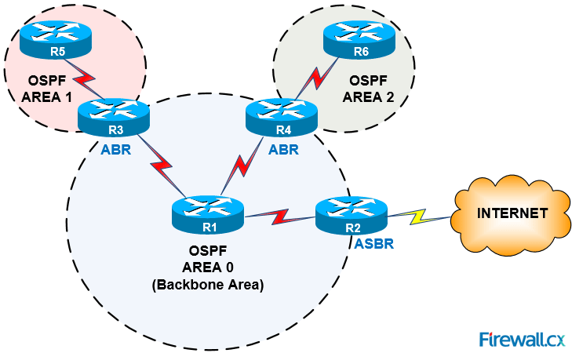

---
## Front matter
lang: ru-RU
title: Динамическая маршрутизация
subtitle:
author:
  - Кобзев Д. К. 
institute:
  - Российский университет дружбы народов, Москва, Россия

## i18n babel
babel-lang: russian
babel-otherlangs: english

## Pdf output format
fontsize: 8pt

## Formatting pdf
toc: false
toc-title: Содержание
slide_level: 2
aspectratio: 169
section-titles: true
theme: metropolis
##Fonts
mainfont: Liberation Serif
sansfont: Liberation Sans
monofont: Liberation Mono
---

# Информация

## Докладчик

:::::::::::::: {.columns align=center}
::: {.column width="70%"}

  * Кобзев Дмитрий Константинович
  * Студент
  * Российский университет дружбы народов
  * НПИбд-01-23

:::
::: {.column width="30%"}

:::
::::::::::::::

# Введение и основные понятия

## Понятие динамической маршрутизации

**Динамическая маршрутизация** — это автоматизированный процесс управления путями передачи данных в компьютерных сетях, реализуемый с помощью специализированных программных протоколов. 

* **Главная задача:** автоматическое построение и актуализация таблиц маршрутизации на всех сетевых узлах (маршрутизаторах).
* **Адаптивность:** сеть самостоятельно реагирует на любые изменения инфраструктуры (отказ интерфейсов, обрыв кабеля, появление новых подсетей, изменение пропускной способности).
* **Сравнение со статикой:** ручной ввод маршрутов не масштабируется в крупных сетях и не обеспечивает отказоустойчивость в реальном времени.

## Метрики протоколов маршрутизации

Для выбора наилучшего пути протоколы используют **метрику** — числовой критерий оценки стоимости маршрута (чем меньше значение, тем приоритетнее путь).

* **Количество переходов (Hop Count):** число промежуточных маршрутизаторов на пути к цели.
* **Пропускная способность (Bandwidth):** скорость передачи данных на физических линках.
* **Задержка (Delay):** время, необходимое для доставки пакета через интерфейс.
* **Надежность (Reliability):** частота возникновения ошибок и сбоев на канале.
* **Загруженность (Load):** текущий уровень загрузки канала трафиком.

## Процесс сходимости сети (Convergence)

**Сходимость (Convergence)** — состояние сети, при котором все маршрутизаторы обладают актуальной, полной и непротиворечивой информацией о топологии.

* **Триггер изменений:** падение линка или добавление нового маршрутизатора запускает процесс перерасчета.
* **Время сходимости:** ключевой показатель эффективности протокола. Чем оно меньше, тем быстрее сеть восстанавливает работоспособность.
* **Проблемы задержки сходимости:** возникновение временных маршрутных петель (Routing Loops) и потеря пакетов ("черные дыры").

# Классификация протоколов

## Архитектурное разделение сетей

:::::::::::::: {.columns align=center}
::: {.column width="50%"}

В масштабах Интернета вся сетевая инфраструктура разбита на **Автономные системы (AS)** — совокупности сетей под единым техническим и административным управлением.

* **Протоколы IGP:** для работы внутри одной автономной системы. Оптимизированы под высокую скорость сходимости.
* **Протоколы EGP:** для связи различных автономных систем между собой. Фокусируются на политиках безопасности.

:::
::: {.column width="50%"}

{width=100%}

:::
::::::::::::::

## Дистанционно-векторные протоколы (Distance-Vector)

Работают по принципу "маршрутизации по слухам". Маршрутизатор не знает полной топологии сети, а доверяет таблицам своих соседей.

* **Алгоритм:** Беллмана-Форда или его модификации.
* **Обмен данными:** периодическая отправка полной (или частичной) таблицы маршрутизации непосредственно подключенным соседям.
* **RIP (Routing Information Protocol):** ограничивает сеть 15 хопами (16 — недостижимая сеть). Медленно сходится, используется в малых сетях.
* **EIGRP:** гибридный протокол Cisco. Использует алгоритм DUAL, композитную метрику и мгновенно сходится благодаря хранению резервных маршрутов.

## Протоколы состояния каналов (Link-State)

:::::::::::::: {.columns align=center}
::: {.column width="50%"}

Каждый маршрутизатор обладает полной и идентичной картой всей сети (базой данных состояния каналов — LSDB).

* **Алгоритм:** Дейкстры (SPF — Shortest Path First) для вычисления кратчайшего пути от себя до всех подсетей.
* **Обмен данными:** рассылка объявлений о состоянии связей (LSA) всем узлам при изменении топологии.
* **OSPF (Open Shortest Path First):** открытый стандарт. Поддерживает разделение на зоны для снижения нагрузки на память и CPU. Основной протокол больших корпоративных сетей.
* **IS-IS:** используется преимущественно операторами связи из-за высокой стабильности и независимости от сетевого протокола (запуск непосредственно над канальным уровнем).

:::
::: {.column width="50%"}

{width=100%}

:::
::::::::::::::

# Внешняя маршрутизация (BGP)

## Протокол граничного шлюза BGP

**BGP (Border Gateway Protocol)** — единственный протокол внешней маршрутизации (EGP), удерживающий целостность глобальной сети Интернет.

* **Категория:** Векторно-путевой протокол (Path-Vector). Включает список номеров AS в маршрутную информацию для предотвращения петель в масштабах планеты.
* **Policy-based Routing:** выбор пути основан не на технических задержках, а на административных и коммерческих политиках (Attributes: AS-Path, Local Preference, MED).
* **Масштаб:** таблицы BGP (Full View) содержат более миллиона маршрутов, что требует от граничных маршрутизаторов колоссальных объемов оперативной памяти.

# Заключение

## Итоги

* **Динамическая маршрутизация** — фундамент отказоустойчивости и масштабируемости современных сетей.
* **Внутренние протоколы (IGP)** решают локальные задачи: RIP уходит в прошлое, уступая место OSPF и EIGRP, которые обеспечивают субсекундную сходимость в рамках предприятий.
* **Внешние протоколы (EGP / BGP)** обеспечивают глобальную связность, управляя потоками данных между провайдерами на основе бизнес-политик.
* **Эволюция:** современные протоколы активно развиваются для поддержки стека IPv6 (OSPFv3, RIPng, MP-BGP) и интеграции с концепцией программно-определяемых сетей (SDN).
