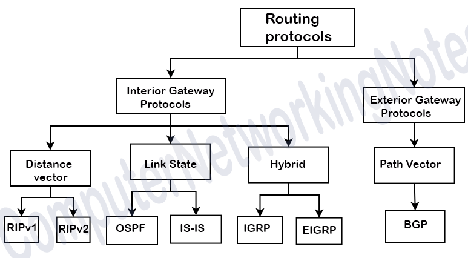

---
## Front matter
title: Динамическая маршрутизация
subtitle:
author: "Кобзев Д. К."

## Generic otions
lang: ru-RU
toc-title: "Содержание"

## Bibliography
bibliography: bib/cite.bib
csl: /home/dkkobzev/pandoc/csl/gost-r-7-0-5-2008-numeric.csl

## Pdf output format
toc: true # Table of contents
toc-depth: 2
lof: true # List of figures
lot: true # List of tables
fontsize: 12pt
linestretch: 1.5
papersize: a4
documentclass: scrreprt
## I18n polyglossia
polyglossia-lang:
  name: russian
  options:
    - spelling=modern
    - babelshorthands=true
polyglossia-otherlangs:
  name: english
## I18n babel
babel-lang: russian
babel-otherlangs: english
## Fonts
mainfont: Liberation Serif
romanfont: Liberation Serif
sansfont: Liberation Sans
monofont: Liberation Mono
# mathfont: Libertinus Math
mainfontoptions: Ligatures=Common,Ligatures=TeX,Scale=0.94
romanfontoptions: Ligatures=Common,Ligatures=TeX,Scale=0.94
sansfontoptions: Ligatures=Common,Ligatures=TeX,Scale=MatchLowercase,Scale=0.94
monofontoptions: Scale=MatchLowercase,Scale=0.94,FakeStretch=0.9

## Pandoc-crossref LaTeX customization
figureTitle: "Рис."
tableTitle: "Таблица"
listingTitle: "Листинг"
lofTitle: "Список иллюстраций"
lotTitle: "Список таблиц"
lolTitle: "Листинги"
## Misc options
indent: true
header-includes:
  - \usepackage{indentfirst}
  - \usepackage{float} # keep figures where there are in the text
  - \floatplacement{figure}{H} # keep figures where there are in the text
---

# Введение в динамическую маршрутизацию

Маршрутизация в компьютерных сетях представляет собой процесс определения оптимального пути движения информационных пакетов от узла-отправителя к узлу-получателю. На заре развития сетевых технологий доминировала статическая маршрутизация, при которой каждый маршрут прописывался системным администратором вручную. Однако по мере роста масштабов сетей, усложнения их топологии и экспоненциального увеличения объемов трафика ручное управление стало неэффективным и экономически нецелесообразным. Статические маршруты лишены гибкости: при выходе из строя промежуточного коммутатора или обрыве кабеля сеть теряет связность до тех пор, пока администратор вручную не изменит конфигурацию оборудования.

Решением данной проблемы стала разработка механизмов динамической маршрутизации. Динамическая маршрутизация — это процесс автоматического обмена информацией о топологии сети между маршрутизаторами с использованием специализированных программных протоколов. Активация этих протоколов позволяет сетевым устройствам непрерывно анализировать состояние сетевой среды, самостоятельно обнаруживать появление новых подсетей, адаптироваться к отказам аппаратного обеспечения и перенаправлять информационные потоки по альтернативным маршрутам в режиме реального времени.

Основными преимуществами динамического подхода являются автоматизация администрирования, высокая отказоустойчивость инфраструктуры и отличная масштабируемость. К недостаткам можно отнести дополнительную нагрузку на центральные процессоры и оперативную память маршрутизаторов, а также выделение части пропускной способности каналов связи под служебный (служебный) трафик маршрутизации.

# Метрики и административное расстояние

Для выбора наилучшего пути в таблице маршрутизации каждый протокол оперирует понятием «метрика». Метрика представляет собой числовой коэффициент, рассчитываемый алгоритмом протокола для оценки «стоимости» передачи данных по конкретному направлению. Если к одной и той же целевой сети ведут несколько физических путей, маршрутизатор выберет тот, у которого значение метрики будет минимальным.

В зависимости от архитектуры конкретного протокола маршрутизации, для расчета метрики могут применяться следующие параметры:
- **Количество переходов (Hop Count):** простейший критерий, учитывающий только число промежуточных маршрутизаторов на пути к цели. Физические характеристики каналов (например, их скорость) при этом полностью игнорируются.
- **Пропускная способность (Bandwidth):** учитывает максимальную скорость передачи данных на интерфейсах. Более скоростной канал получает меньшую стоимость (лучшую метрику).
- **Задержка (Delay):** суммарное время, необходимое для прохождения пакета через физическую среду и буферы интерфейсов сетевых устройств.
- **Надежность (Reliability):** динамически изменяемый параметр, отражающий стабильность работы линка на основе анализа количества ошибочных или потерянных пакетов.
- **Загруженность (Load):** показатель текущего использования полосы пропускания трафиком, позволяющий распределять потоки данных в обход перегруженных узлов.

В ситуациях, когда на одном маршрутизаторе одновременно запущены несколько различных протоколов динамической маршрутизации (например, OSPF и RIP), возникает конфликт: каждый протокол предложит свой собственный «лучший» маршрут к одной и той же подсети. Для разрешения таких коллизий используется механизм **Административного расстояния (Administrative Distance, AD)**. 

Административное расстояние — это показатель степени доверия к источнику маршрутной информации, выраженный целым числом от 0 до 255. Чем меньше значение AD, тем выше приоритет источника. Например, напрямую подключенный интерфейс (Connected) имеет AD = 0, статический маршрут — AD = 1, протокол OSPF — AD = 110, а протокол RIP — AD = 120. Таким образом, маршрутизатор предпочтет информацию от OSPF и внесет в рабочую таблицу маршрутизации именно его путь, проигнорировав данные RIP.

# Процесс сходимости и проблемы стабильности

Ключевым критерием эффективности любого динамического протокола является скорость достижения **сходимости (Convergence)**. Сеть считается сошедшейся, если все её маршрутизаторы завершили циклы вычислений, обменялись служебными сообщениями и сформировали актуальные, полные и идентичные (в рамках сегмента) представления о текущей топологии сети.

Процесс сходимости инициируется при возникновении любого значимого сетевого события (триггера):
1. Отказ физического интерфейса или обрыв оптоволоконной линии.
2. Включение нового маршрутизатора или добавление новой подсети.
3. Изменение параметров пропускной способности или задержки на интерфейсе.

До тех пор, пока процесс сходимости во всей сети не завершен, сетевая инфраструктура находится в нестабильном состоянии. В этот промежуток времени высока вероятность возникновения опасных аномалий, таких как **маршрутные петли (Routing Loops)**. Петля маршрутизации возникает, когда два или более маршрутизатора из-за устаревшей информации начинают бесконечно пересылать пакет, предназначенный для удаленной сети, друг другу. Это приводит к лавинообразному росту нагрузки на каналы связи, утилизации процессоров устройств и полной потере пользовательского трафика.

Для борьбы с маршрутными петлями (особенно в дистанционно-векторных протоколах) применяются специализированные инженерные методы:
- **Split Horizon (расщепление горизонта):** правило, запрещающее маршрутизатору отправлять информацию о подсети через тот же самый интерфейс, от которого эта информация была изначально получена.
- **Route Poisoning (отравление маршрута):** при обнаружении падения сети маршрутизатор немедленно выставляет для нее метрику, равную «бесконечности» (например, 16 хопов для RIP), и рассылает это объявление соседям, принудительно исключая ее из их таблиц.
- **Hold-down Timers (таймеры удержания):** механизм, заставляющий маршрутизатор временно игнорировать любые новые объявления о восстановлении упавшей сети от соседей, чтобы избежать фиксации ложных или колеблющихся (flapping) маршрутов.

# Классификация протоколов динамической маршрутизации

Для систематизации протоколов динамической маршрутизации применяется многоуровневая классификация, базирующаяся на административных границах эксплуатации и используемых математических алгоритмах.

В зависимости от области применения протоколы делятся на:
- **Внутренние (Interior Gateway Protocols, IGP):** эксплуатируются внутри одной Автономной Системы (AS). Автономная система представляет собой единую сетевую инфраструктуру, контролируемую одной организацией или провайдером и управляемую общей технической политикой. Протоколы IGP нацелены на максимальную скорость сходимости и учитывают тонкие физические параметры внутренних каналов связи.
- **Внешние (Exterior Gateway Protocols, EGP):** применяются для обеспечения взаимодействия и обмена маршрутной информацией между независимыми автономными системами в глобальной сети. Главный приоритет EGP — масштабируемость и возможность применения жестких административных и экономических политик фильтрации трафика.

По принципу технологического функционирования и используемым алгоритмам внутренние протоколы (IGP) подразделяются на две большие группы: дистанционно-векторные и протоколы состояния каналов.

{#fig:classification width=75%}

# Дистанционно-векторные протоколы

Дистанционно-векторные протоколы исторически появились первыми. В основе их работы лежит математический алгоритм Беллмана-Форда. Базовый принцип функционирования таких протоколов часто называют «маршрутизацией по слухам». Маршрутизатор не обладает информацией о глобальной физической структуре всей сети; он знает лишь «вектор» (интерфейс выхода или IP-адрес следующего прыжка — Next-Hop) и «дистанцию» (метрику) до целевой подсети, основываясь исключительно на таблицах, переданных ему соседними устройствами.

Специфика функционирования классических дистанционно-векторных протоколов заключается в циклической (по таймеру) отправке полных копий своих таблиц маршрутизации всем непосредственно подключенным соседям посредством широковещательных или многоадресных запросов.

Наиболее известным представителем этого класса является протокол **RIP (Routing Information Protocol)**, существующий в версиях RIPv1, RIPv2 (с поддержкой бесклассовой маршрутизации CIDR) и RIPng (для сетей IPv6). Метрикой RIP является исключительно количество хопов. Главный недостаток протокола — жесткое ограничение диаметра сети в 15 хопов. Сеть, находящаяся на расстоянии 16 хопов, считается недостижимой. Из-за медленной сходимости и неэффективного использования каналов RIP сегодня применяется только в небольших, технологически изолированных сегментах сетей.

Более совершенным решением является протокол **EIGRP (Enhanced Interior Gateway Routing Protocol)**, разработанный корпорацией Cisco. EIGRP относится к категории гибридных протоколов, поскольку сочетает в себе лучшие свойства дистанционно-векторного подхода и протоколов состояния каналов. Он использует усовершенствованный алгоритм диффузного обновления (DUAL) и рассчитывает сложную композитную метрику на основе пропускной способности и задержки. EIGRP не рассылает таблицы по таймеру — обмен данными происходит только при изменении топологии (триггерные обновления). Протокол хранит не только основные, но и резервные маршруты (Feasible Successors), что позволяет ему осуществлять сходимость сети за сотые доли секунды.

# Протоколы состояния каналов (Link-State)

Протоколы состояния каналов (Link-State) представляют собой более сложную, но мощную и масштабируемую технологию. В отличие от дистанционно-векторных систем, каждый маршрутизатор в Link-State сети обладает абсолютно точной, полной и идентичной картой всей сетевой инфраструктуры в рамках своей зоны ответственности.

Функционирование протоколов этого класса базируется на алгоритме Дейкстры (SPF — Shortest Path First, «кратчайший путь первым»). Процесс работы состоит из нескольких этапов:
1. Каждое устройство определяет свои локальные, напрямую подключенные интерфейсы и их характеристики (состояние каналов).
2. Маршрутизаторы устанавливают отношения соседства с помощью периодической отправки небольших пакетов приветствия (Hello packets).
3. Устройства формируют специальные сообщения — Объявления о состоянии каналов (Link-State Advertisements, LSA) — и лавинно рассылают их по всей сети. Каждый маршрутизатор копирует LSA в свою локальную Базу данных состояния каналов (Link-State Database, LSDB).
4. После синхронизации LSDB на всех узлах сети каждый маршрутизатор запускает алгоритм Дейкстры, принимая самого себя за корень графа, и вычисляет кратчайшие пути ко всем доступным подсетям, занося результаты в таблицу маршрутизации.

Основным представителем Link-State протоколов является **OSPF (Open Shortest Path First)**. OSPF — это открытый стандарт, разработанный инженерным советом Интернета (IETF). Он обладает сверхбыстрой сходимостью, поддерживает концепцию бесклассовой маршрутизации и аутентификацию служебных сообщений. Метрикой OSPF является стоимость (Cost), обратно пропорциональная пропускной способность канала. Для минимизации нагрузки на аппаратные ресурсы OSPF позволяет делить крупную сеть на логические области (зоны).

Другим мощным протоколом состояния каналов является **IS-IS (Intermediate System to Intermediate System)**. Он архитектурно схож с OSPF, однако работает непосредственно поверх канального уровня (L2), что делает его невосприимчивым к IP-атакам и позволяет легко масштабироваться для одновременной маршрутизации трафика IPv4 и IPv6. Протокол IS-IS завоевал прочные позиции в опорных сетях (Core) магистральных интернет-провайдеров.

# Иерархическая организация сетей на примере OSPF

Для обеспечения стабильной работы протоколов состояния каналов в крупномасштабных сетях критически важно применять иерархический подход. Если запустить OSPF в сети, состоящей из нескольких сотен маршрутизаторов, в рамках одной общей зоны, объем базы данных LSDB станет колоссальным. Любое колебание порта на удаленном коммутаторе вызовет лавину LSA по всей сети и принудительный ресурсоемкий перерасчет алгоритма SPF на каждом устройстве, что может парализовать работу сети.

Для предотвращения подобных сценариев OSPF использует деление сети на **зоны (Areas)**. Зона OSPF — это логическая группировка смежных сетей и маршрутизаторов. Вся топологическая информация (детальные LSA) циркулирует исключительно внутри границ конкретной зоны. Маршрутизаторы, находящиеся внутри зоны (Internal Routers), знают все подробности её структуры, но получают лишь агрегированные суммарные маршруты о других зонах.

Иерархия OSPF строится вокруг центральной зоны:
- **Магистральная зона (Area 0 / Backbone Area):** ядро OSPF-сети. Все остальные периферийные зоны обязаны иметь физическое или логическое подключение к Area 0. Весь межзонный трафик в обязательном порядке проходит через магистраль.
- **Стандартные зоны (Non-backbone areas):** периферийные области, объединяющие конечных пользователей и локальные ресурсы.

Связующими элементами иерархии выступают специальные типы маршрутизаторов:
- **ABR (Area Border Router):** пограничный маршрутизатор зоны. Он имеет интерфейсы, принадлежащие одновременно к двум и более зонам (обязательно включая Area 0). ABR отвечает за агрегацию маршрутной информации и передачу её между зонами. На нем происходит генерация суммарных LSA, что изолирует локальные проблемы топологии внутри одной зоны.
- **ASBR (Autonomous System Boundary Router):** пограничный маршрутизатор автономной системы. Он осуществляет связь между OSPF-сетью и внешними источниками маршрутов (другими автономными системами, протоколами RIP/BGP или статическими маршрутами), выполняя процедуру перераспределения маршрутов (Redistribution).

{#fig:ospf_hierarchy width=75%}

# Протоколы внешней маршрутизации. Протокол BGP

Если внутренние протоколы (IGP) ориентированы на скорость и автоматический учет технических параметров линков внутри коммерческой компании или ЦОД, то на стыке между независимыми провайдерами и государствами действуют совершенно иные законы. Глобальный Интернет состоит из десятков тысяч автономных систем (AS), принадлежащих коммерческим операторам связи, транснациональным корпорациям и государственным структурам. Единственным инструментом, связывающим эти разрозненные сегменты воедино, является протокол **BGP (Border Gateway Protocol)** текущей четвертой версии (BGPv4).

BGP классифицируется как **векторно-путевой протокол (Path-Vector Protocol)**. В отличие от IGP, метрикой BGP является не абстрактное число стоимости или количество хопов маршрутизаторов, а упорядоченный список номеров автономных систем (AS-Path), через которые должен пройти пакет для достижения цели. Анализ списка AS-Path на логическом уровне полностью исключает появление маршрутных петель в масштабах глобального Интернета: если маршрутизатор видит в полученном объявлении номер собственной AS, он немедленно отбрасывает такое объявление.

Выбор маршрута в BGP базируется на концепции **Policy-based Routing (маршрутизация на основе политик)**. Протокол использует разветвленную систему атрибутов пути (Path Attributes), таких как Local Preference, Autonomous System Path, Multi-Exit Discriminator (MED) и Weight. Манипулируя значениями этих атрибутов, сетевые инженеры могут гибко управлять входящими и исходящими потоками трафика, руководствуясь не технической целесообразностью (скоростью канала), а экономическими факторами, требованиями безопасности и межоператорскими договоренностями (например, направлять трафик через менее дорогого магистрального провайдера).

Современные BGP-маршрутизаторы обрабатывают таблицы маршрутизации (глобальный Full View), содержащие более миллиона префиксов. Это предъявляет экстремальные требования к аппаратному обеспечению операторского класса, требуя установки терабитных коммутационных матриц и сотен гигабайт специализированной оперативной памяти.

# Вывод

Динамическая маршрутизация представляет собой базовую технологическую основу, обеспечивающую функционирование современного глобального информационного общества. Разделение протоколов на классы позволило эффективно решить проблемы масштабируемости сетевой инфраструктуры. 

Внутренние протоколы состояния каналов, такие как OSPF и IS-IS, за счет использования строгих математических графовых алгоритмов и иерархического зонирования, гарантируют стабильную работу и субсекундную сходимость внутри корпоративных систем и операторских сетей. В то же время протокол граничного шлюза BGP успешно решает задачи интеграции этих систем в масштабах планеты, переводя управление трафиком из плоскости сугубо технических метрик в плоскость административных и коммерческих политик. Дальнейшее развитие динамической маршрутизации неразрывно связано с массовым переходом на стек адресации IPv6 и интеграцией классических протоколов с технологиями Программно-определяемых сетей (SDN), где централизованные контроллеры берут на себя функции управления (Control Plane), оставляя маршрутизаторам роль высокоскоростных фабрик продвижения пакетов (Data Plane).

# Список литературы{.unnumbered}
