---
## Front matter
title: Лабораторная работа
subtitle: Номер 1
author: "Кобзев Д. К."

## Generic otions
lang: ru-RU
toc-title: "Содержание"

## Bibliography
bibliography: bib/cite.bib
csl: /home/dkkobzev/pandoc/csl/gost-r-7-0-5-2008-numeric.csl

## Pdf output format
toc: true # Table of contents
toc-depth: 2
lof: true # List of figures
lot: true # List of tables
fontsize: 12pt           # ← ИСПРАВЛЕНО: было 1pt, стало 12pt
linestretch: 1.5
papersize: a4
documentclass: scrreprt
## I18n polyglossia
polyglossia-lang:
  name: russian
  options:
    - spelling=modern
    - babelshorthands=true
polyglossia-otherlangs:
  name: english
## I18n babel
babel-lang: russian
babel-otherlangs: english
## Fonts
mainfont: Liberation Serif
romanfont: Liberation Serif
sansfont: Liberation Sans
monofont: Liberation Mono
# mathfont: Libertinus Math   # ← ЗАКОММЕНТИРОВАНО (временно)
mainfontoptions: Ligatures=Common,Ligatures=TeX,Scale=0.94
romanfontoptions: Ligatures=Common,Ligatures=TeX,Scale=0.94
sansfontoptions: Ligatures=Common,Ligatures=TeX,Scale=MatchLowercase,Scale=0.94
monofontoptions: Scale=MatchLowercase,Scale=0.94,FakeStretch=0.9

## Pandoc-crossref LaTeX customization
figureTitle: "Рис."
tableTitle: "Таблица"
listingTitle: "Листинг"
lofTitle: "Список иллюстраций"
lotTitle: "Список таблиц"
lolTitle: "Листинги"
## Misc options
indent: true
header-includes:
  - \usepackage{indentfirst}
  - \usepackage{float} # keep figures where there are in the text
  - \floatplacement{figure}{H} # keep figures where there are in the text
---

# Цель работы

Целью данной работы является установка инструмента моделирования конфигурации сети Cisco Packet Tracer, знакомство с его интерфейсом.

# Выполнение лабораторной работы

В рабочем пространстве размещаем концентратор (Hub-PT) и четыре оконечных устройства PC. Соединяем оконечные устройства с концентратором прямым кабелем. Щёлкнув последовательно на каждом оконечном устройстве, задаем статические IP-адреса 192.168.1.11, 192.168.1.1, 192.168.1.13, 192.168.1.14 с маской подсети 255.255.255.0 (Рис. 1.1).

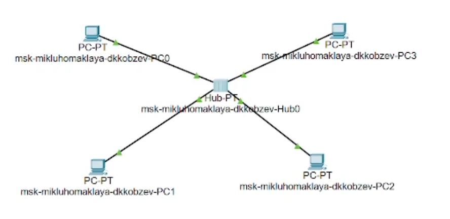{height=60%}

В основном окне проекта переходим из режима реального времени (Realtime) в режим моделирования (Simulation). Выбераем на панели инструментов мышкой «Add Simple PDU (P)» и щёлкаем сначала на PC0, затем на PC2. В рабочей области появились два конверта, обозначающих пакеты, в списке событий на панели моделирования появились
два события, относящихся к пакетам ARP и ICMP соответственно. На панели моделирования нажимаем кнопку «Play» и следим за движением пакетов ARP и ICMP от устройства PC0 до устройства PC2 и обратно (Рис. 1.2).

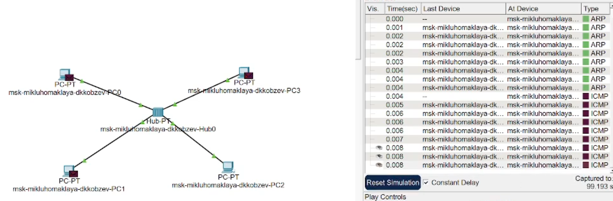{height=60%}

Щёлкнув на строке события, открываем окно информации о PDU и изучаем, что происходит на уровне модели OSI при перемещении пакета (Рис. 1.3).

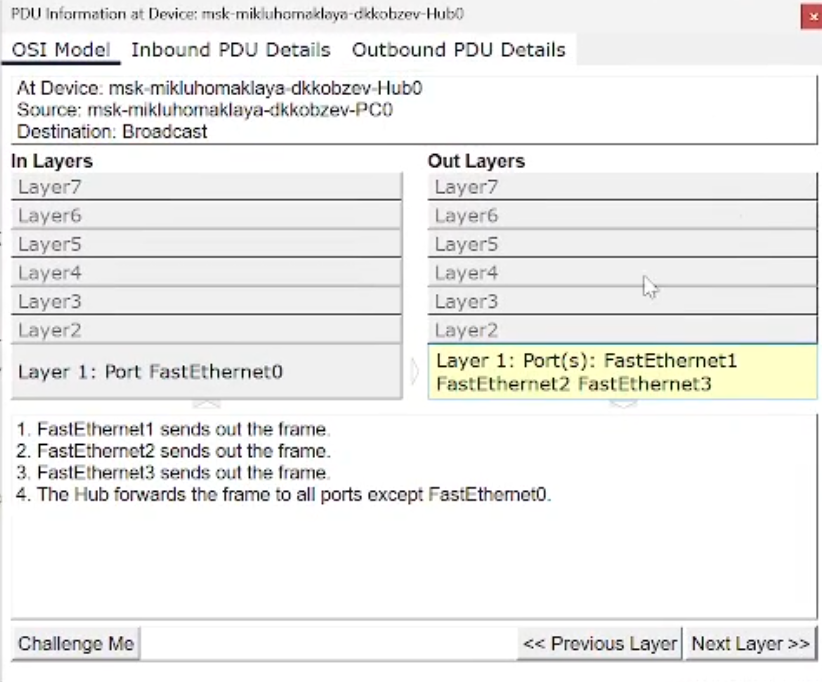{height=60%}

Открываем вкладку с информацией о PDU. Исследуем структуру пакета ICMP. Описываем структуру кадра Ethernet. Описывааем структуру MAC-адресов (Рис. 1.4).

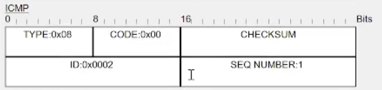{height=60%}

Очищаем список событий, удалив сценарий моделирования. Выбераем на панели инструментов мышкой «Add Simple PDU (P)» и щёлкаем сначала на PC0, затем на PC2. Снова выбераем на панели инструментов мышкой «Add Simple PDU (P)» и щёлкаем сначала на PC2, затем на PC0. На панели моделирования нажимаем кнопку «Play» и следим за возникновением коллизии. В списке событий смотрим информацию о PDU (Рис. 1.5).

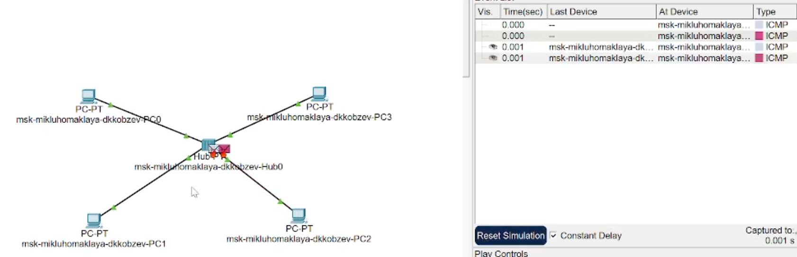{height=60%}

Переходим в режим реального времени (Realtime). В рабочем пространстве размещаем коммутатор (например Cisco 2950-24) и 4 оконечных устройства PC. Соединяем оконечные устройства с коммутатором прямым кабелем. Щёлкнув последовательно на каждом оконечном устройстве, задаем статические IP-адреса 192.168.1.21, 192.168.1.22, 192.168.1.23, 192.168.1.24 с маской подсети 255.255.255.0 (Рис. 1.6).

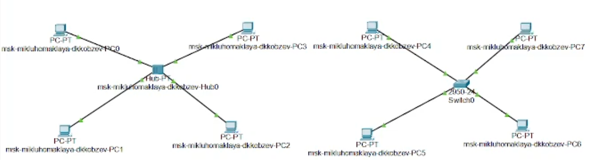{height=60%}

В основном окне проекта переходим из режима реального времени (Realtime) в режим моделирования (Simulation). Выбераем на панели инструментов мышкой «Add Simple PDU (P)» и щёлкаем сначала на PC4, затем на PC6. В рабочей области появились два конверта, обозначающих пакеты, в списке событий на панели моделирования появились два события, относящихся к пакетам ARP и ICMP соответственно. На панели моделирования нажимаем кнопку «Play» и следим за движением пакетов ARP и ICMP от устройства PC4 до устройства PC6 и обратно (Рис. 1.7).

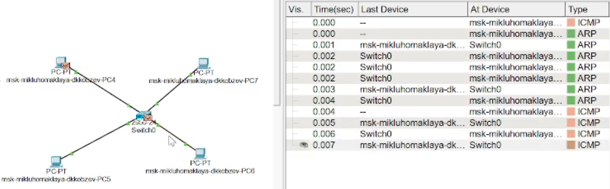{height=60%}

Открываем вкладку с информацией о PDU. Исследуем структуру пакета ICMP. Описываем структуру кадра Ethernet. Описывааем структуру MAC-адресов (Рис. 1.8).

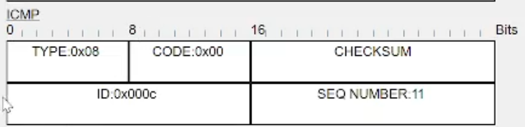{height=60%}

Очищаем список событий, удалив сценарий моделирования. Выбераем на панели инструментов мышкой «Add Simple PDU (P)» и щёлкаем сначала на PC4, затем на PC6. Снова выбераем на панели инструментов мышкой «Add Simple PDU (P)» и щёлкаем сначала на PC6, затем на PC4. На панели моделирования нажимаем кнопку «Play» и следим за движением пакетов (Рис. 1.9).

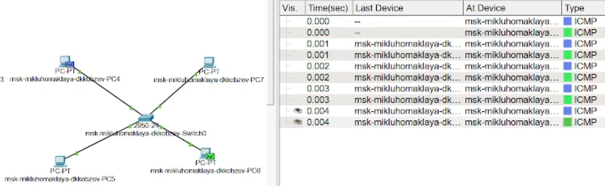{height=60%}

Переходим в режим реального времени (Realtime). В рабочем пространстве соединияем кроссовым кабелем концентратор и коммутатор. Переходим в режим моделирования (Simulation). Очищаем список событий, удалив сценарий моделирования. Выбераем на панели инструментов мышкой «Add Simple PDU (P)» и щёлкаем сначала на PC0, затем на PC4. Снова выбераем на панели инструментов мышкой «Add Simple PDU (P)» и щёлкаем
сначала на PC4, затем на PC0. На панели моделирования нажимаем кнопку «Play» и следим за движением пакетов (Рис. 1.10).

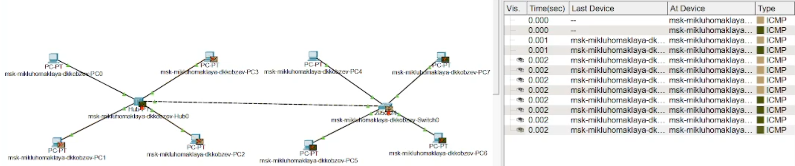{height=60%}

Очищаем список событий, удалив сценарий моделирования. На панели моделирования нажимаем «Play» и в списке событий получаем пакеты STP. Исследуем структуру STP. Описываем структуру кадра Ethernet в этих пакетах. Описываем структуру MAC-адресов (Рис. 1.11).

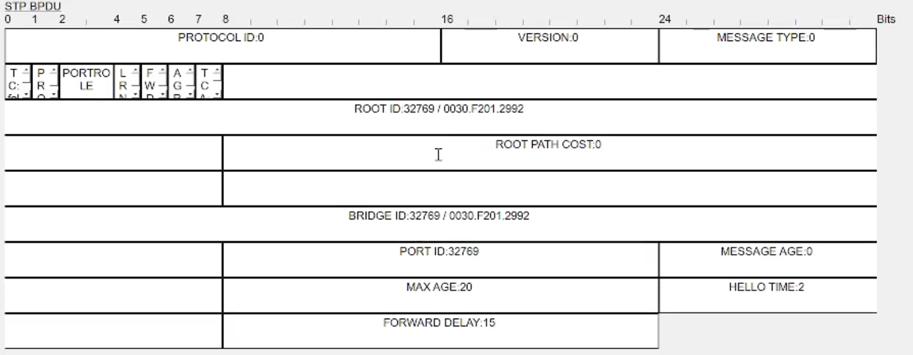{height=60%}

Переходим в режим реального времени (Realtime). В рабочем пространстве добавляем маршрутизатор (например, Cisco 2811). Соединяем прямым кабелем коммутатор и маршрутизатор. Щёлкаем на маршрутизаторе и на вкладке его конфигурации прописываем статический IP-адрес 192.168.1.254 с маской 255.255.255.0, активируем порт, поставив галочку «On» напротив «Port Status» (Рис. 1.12).

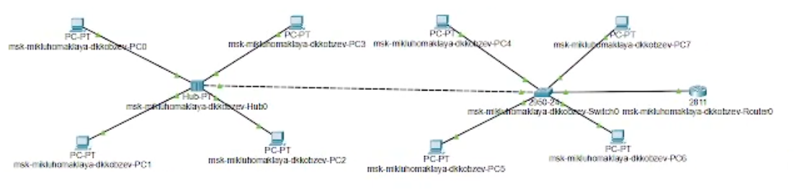{height=60%}

Переходим в режим моделирования (Simulation). Очищаем список событий, удалив сценарий моделирования. Выбераем на панели инструментов мышкой «Add Simple PDU (P)» и щёлкаем сначала на PC3, затем на маршрутизаторе. На панели моделирования нажимаем кнопку «Play» и следим за движением пакетов ARP, ICMP, STP и CDP. Исследуем структуру пакета CDP, описываем структуру кадра Ethernet. Описывем структуру MAC-адресов. (Рис. 1.13).

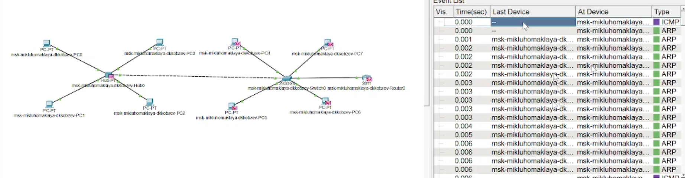{height=60%}

# Выводы

В результате выполнения лабораторной работы мною был установлен инструмент моделирования конфигурации сети Cisco Packet Tracer и я был ознакомился с его интерфейсом.

# Список литературы{.unnumbered}
