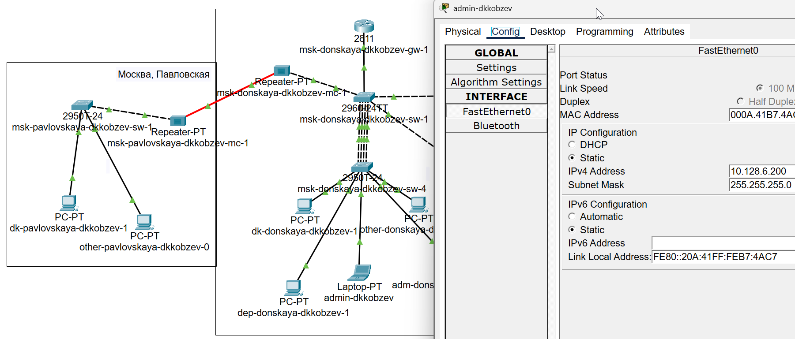
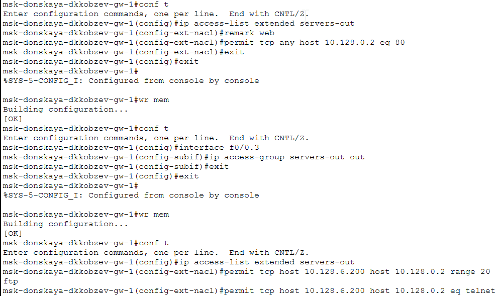
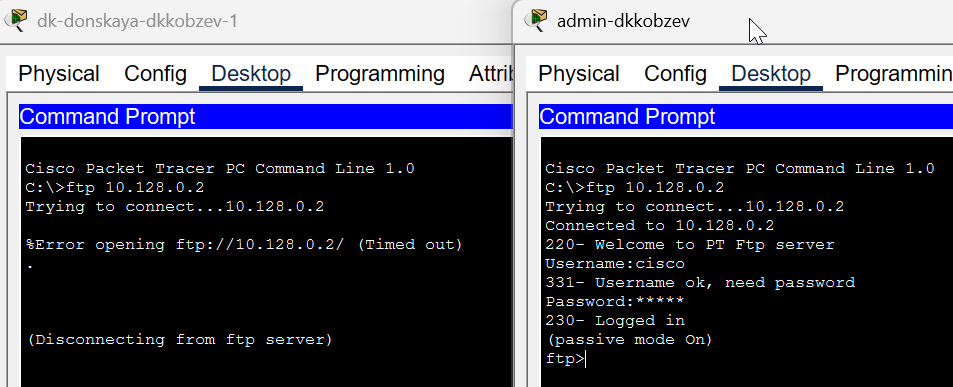
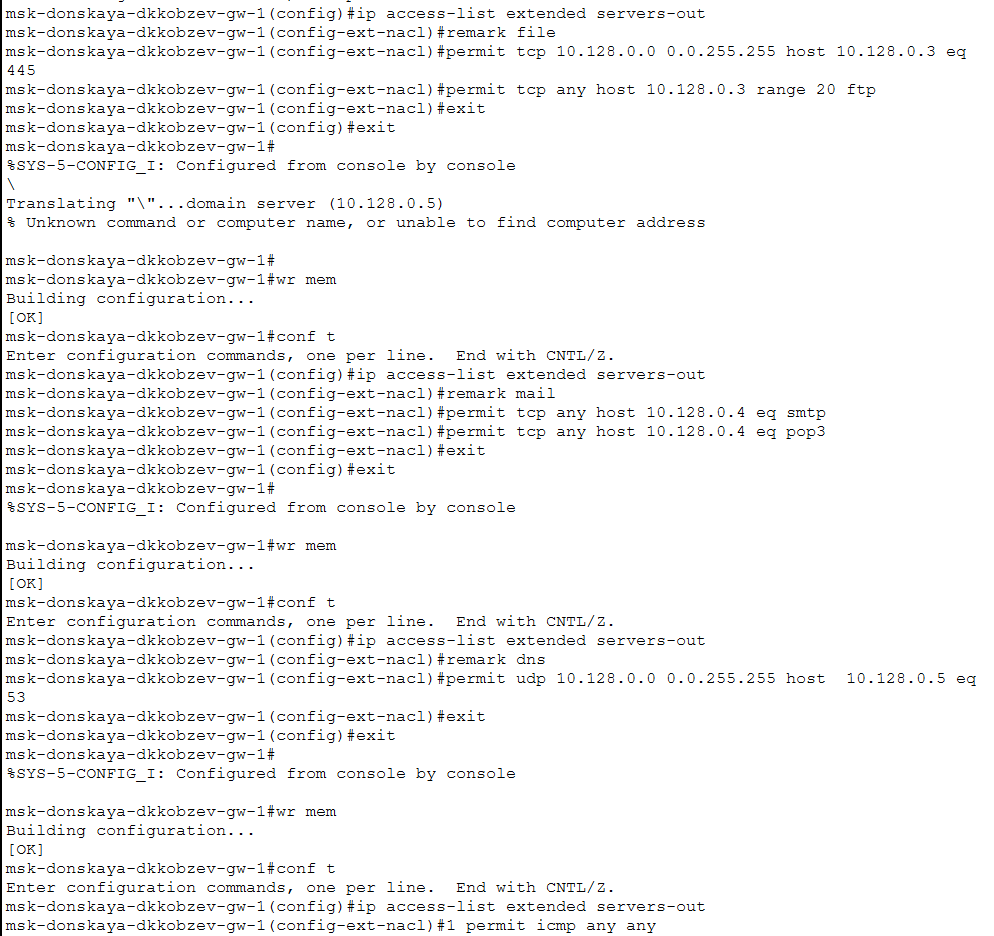
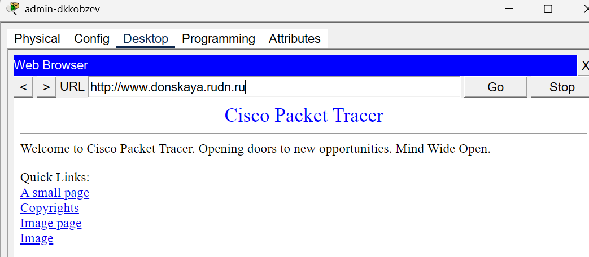
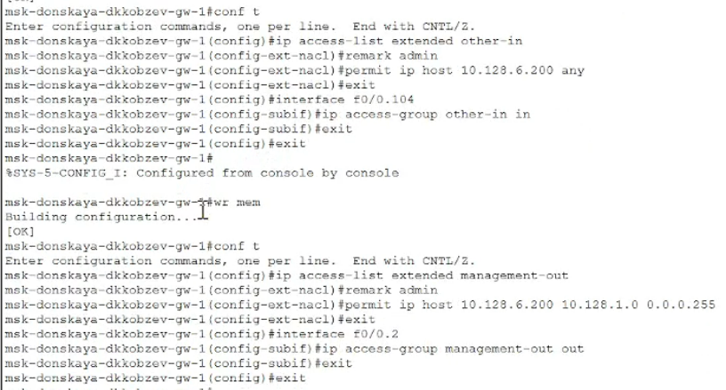
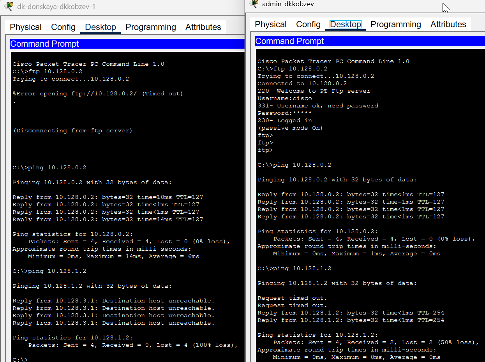
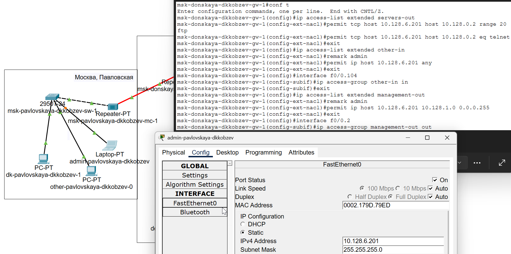

---
## Front matter
lang: ru-RU
title: Лабораторная работа
subtitle: Номер 10
author:
  - Кобзев Д. К. 
institute:
  - Российский университет дружбы народов, Москва, Россия
date: 18 июня 2026

## i18n babel
babel-lang: russian
babel-otherlangs: english

## Pdf output format
fontsize: 8pt

## Formatting pdf
toc: false
toc-title: Содержание
slide_level: 2
aspectratio: 169
section-titles: true
theme: metropolis
##Fonts
mainfont: Liberation Serif
sansfont: Liberation Sans
monofont: Liberation Mono
---

# Информация

## Докладчик

:::::::::::::: {.columns align=center}
::: {.column width="70%"}

  * Кобзев Дмитрий Константинович
  * Студент
  * Российский университет дружбы народов
  * НПИбд-01-23

:::
::: {.column width="30%"}

:::
::::::::::::::

## Цель работы

Целью данной работы является освоение настройки прав доступа пользователей к ресурсам сети.

## Настройка списков управления доступом (ACL)

В рабочей области проекта подключаем ноутбук администратора с именем admin к сети к other-donskaya-1 с тем, чтобы разрешить ему потом любые действия, связанные с управлением сетью. Для этого подсоединяем ноутбук к порту 24 коммутатора msk-donskaya-sw-4 и присваиваем ему статический адрес 10.128.6.200, указав в качестве gateway-адреса 10.128.6.1 и адреса DNS-сервера 10.128.0.5  (Рис. 1.1).

{height=60%}

## Настройка списков управления доступом (ACL)

Настраиваем доступ к web-серверу по порту tcp 80.
Добавляем список управления доступом к интерфейсу.
Настраиваем дополнительный доступ для администратора по протоколам Telnet и FTP (Рис. 1.2).

{height=60%}

## Настройка списков управления доступом (ACL)

Убеждаемся, что с узла с ip-адресом 10.128.6.200 есть доступ по протоколу FTP (Рис. 1.3)

{height=60%}

## Настройка списков управления доступом (ACL)

Настраиваем доступ к файловому серверу.
Настраиваем доступ к почтовому серверу.
Настраиваем доступ к DNS-серверу.
Разрешаем icmp-запросы (Рис. 1.4).

{height=60%}

## Настройка списков управления доступом (ACL)

Проверяем доступность web-сервера (Рис. 1.5).

{height=60%}

## Настройка списков управления доступом (ACL)

Настраиваем доступ для сети Other.
Настраиваем доступ администратора к сети сетевого оборудования (Рис. 1.6).

{height=60%}

## Самостоятельная работа

Проверяем корректность установленных правил доступа, попытавшись получить доступ по различным протоколам с разных устройств сети к подсети серверов и подсети сетевого оборудования (Рис. 1.7).

{height=60%}

## Самостоятельная работа

Разрешаем администратору из сети Other на Павловской действия, аналогичные действиям администратора сети Other на Донской. (Рис. 1.8).

{height=60%}

## Выводы

В результате выполнения лабораторной работы мною была освоена настройка прав доступа пользователей к ресурсам сети.