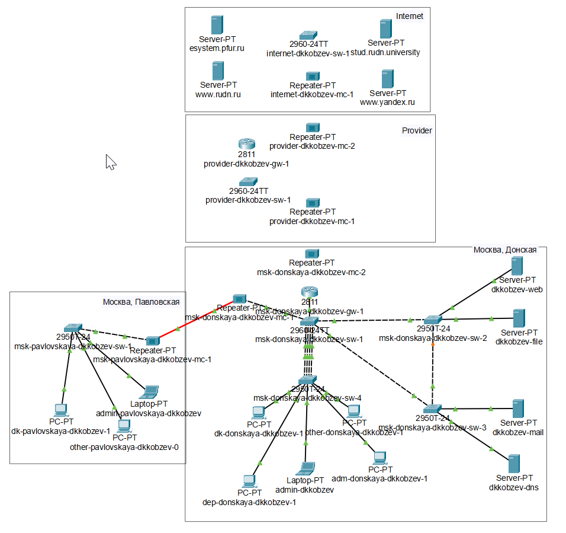
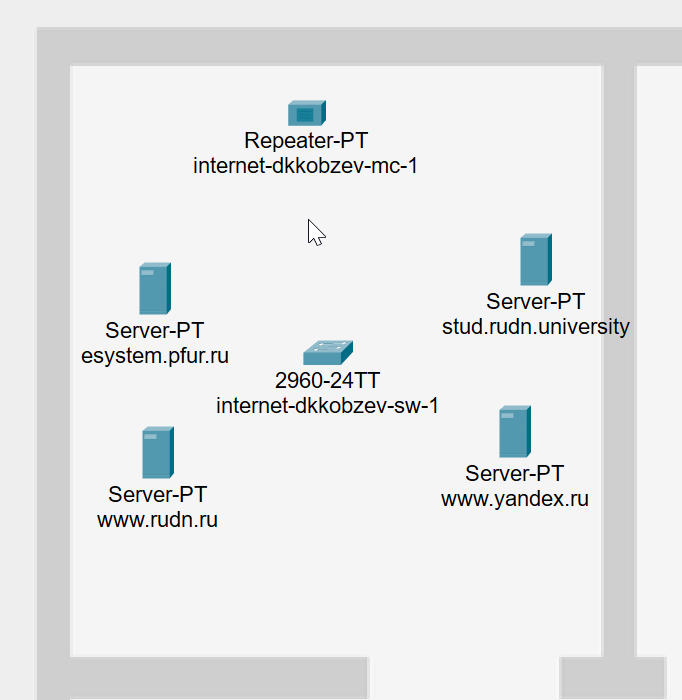
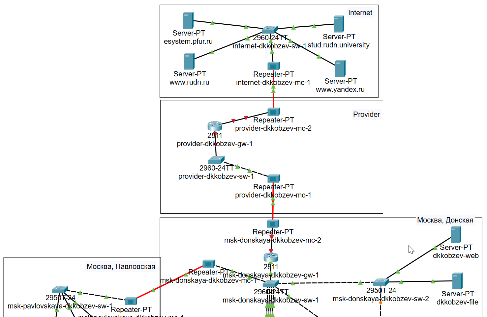

---
## Front matter
lang: ru-RU
title: Лабораторная работа
subtitle: Номер 11
author:
  - Кобзев Д. К. 
institute:
  - Российский университет дружбы народов, Москва, Россия
date: 18 июня 2026

## i18n babel
babel-lang: russian
babel-otherlangs: english

## Pdf output format
fontsize: 8pt

## Formatting pdf
toc: false
toc-title: Содержание
slide_level: 2
aspectratio: 169
section-titles: true
theme: metropolis
##Fonts
mainfont: Liberation Serif
sansfont: Liberation Sans
monofont: Liberation Mono
---

# Информация

## Докладчик

:::::::::::::: {.columns align=center}
::: {.column width="70%"}

  * Кобзев Дмитрий Константинович
  * Студент
  * Российский университет дружбы народов
  * НПИбд-01-23

:::
::: {.column width="30%"}

:::
::::::::::::::

## Цель работы

Целью данной работы является проведение подготовительных мероприятий по подключению локальной сети организации к Интернету.

## Настройка NAT. Планирование

На схеме предыдущего проекта размещаем необходимое оборудование для сети провайдера и сети модельного Интернета.
Присваиваем названия размещённым в сети провайдера и в сети модельного Интернета объектам согласно модельным предположениям и схеме L1 (Рис. 1.1).

{height=60%}

## Настройка NAT. Планирование

В физической рабочей области добавляем здание провайдера и здание, имитирующее расположение серверов модельного Интернета. Присваиваем им соответствующие названия (Рис. 1.2).

{height=60%}

## Настройка NAT. Планирование

Переносим из сети «Донская» оборудование провайдера и модельной сети Интернета в соответствующие здания (Рис. 1.3), (Рис. 1.4).

{height=60%}

## Настройка NAT. Планирование

{height=60%}

## Настройка NAT. Планирование

На медиаконвертерах заменяем имеющиеся модули на PT-REPEATER-NM-1FFE и PT-REPEATER-NM-1CFE для подключения витой пары по технологии Fast Ethernet и оптоволокна соответственно (Рис. 1.5).

{height=60%}

## Настройка NAT. Планирование

Проводим соединение объектов согласно скорректированной схеме L1 (Рис. 1.6).

{height=60%}

## Настройка NAT. Планирование

Прописываем IP-адреса серверам согласно табл. (Рис. 1.7).

{height=60%}

## Настройка NAT. Планирование

Прописываем сведения о серверах на DNS-сервере сети «Донская» (Рис. 1.8).

{height=60%}

## Выводы

В результате выполнения лабораторной работы мною были проведены подготовительные мероприятия по подключению локальной сети организации к Интернету.