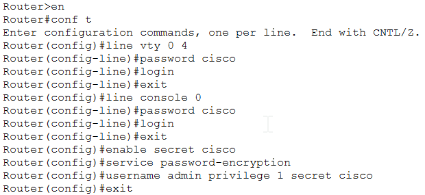
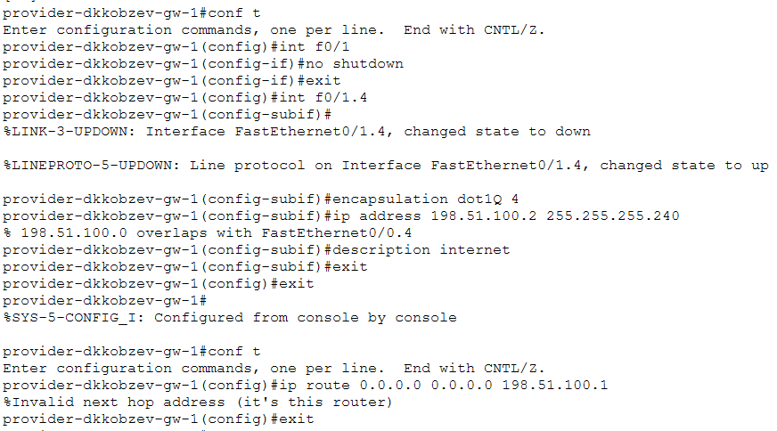
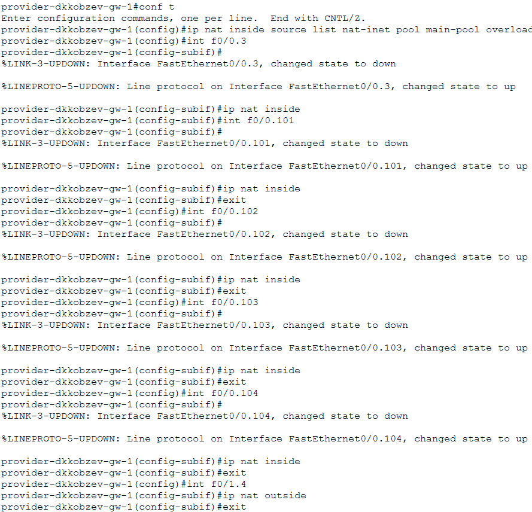

---
## Front matter
lang: ru-RU
title: Лабораторная работа
subtitle: Номер 12
author:
  - Кобзев Д. К. 
institute:
  - Российский университет дружбы народов, Москва, Россия
date: 2 мая 2026

## i18n babel
babel-lang: russian
babel-otherlangs: english

## Pdf output format
fontsize: 8pt

## Formatting pdf
toc: false
toc-title: Содержание
slide_level: 2
aspectratio: 169
section-titles: true
theme: metropolis
##Fonts
mainfont: Liberation Serif
sansfont: Liberation Sans
monofont: Liberation Mono
---

# Информация

## Докладчик

:::::::::::::: {.columns align=center}
::: {.column width="70%"}

  * Кобзев Дмитрий Константинович
  * Студент
  * Российский университет дружбы народов
  * НПИбд-01-23

:::
::: {.column width="30%"}

:::
::::::::::::::

## Цель работы

Целью данной работы является приобретение практических навыков по настройке доступа локальной сети к внешней сети посредством NAT.

## Первоначальная настройка маршрутизатора provider-gw-1

Выполняем первоначальную настройку маршрутизатора provider-gw-1 (Рис. 1.1).

{height=60%}

## Первоначальная настройка коммутатора provider-sw-1

Выполняем первоначальную настройку коммутатора provider-sw-1 (Рис. 1.2).

{height=60%}

## Настройка интерфейсов маршрутизатора provider-gw-1

Настраиваем интерфейсы маршрутизатора provider-gw-1 (Рис. 1.3).

{height=60%}

## Настройка интерфейсов коммутатора provider-sw-1

Настраиваем интерфейсы коммутатора provider-sw-1 (Рис. 1.4)

{height=60%}

## Настройка интерфейсов маршрутизатора msk-donskaya-gw-1

Настраиваем интерфейсы маршрутизатора msk-donskaya-gw-1 (Рис. 1.5).

{height=60%}

## Настройка пула адресов и списка доступа для NAT

Настраиваем пул адресов и список доступа для NAT (Рис. 1.6).

{height=60%}

## Настройка NAT

Настраиваем  Port Address Translation и интерфейсы для NAT (Рис. 1.8).

{height=60%}

## Настройка доступа из Интернета

Настраиваем доступ из Интернета для веб, файлового и почтового серверов и доступ по RDP (Рис. 1.9).

{height=60%}

## Выводы

В результате выполнения лабораторной работы мною были приобретены практические навыки по настройке доступа локальной сети к внешней сети посредством NAT.