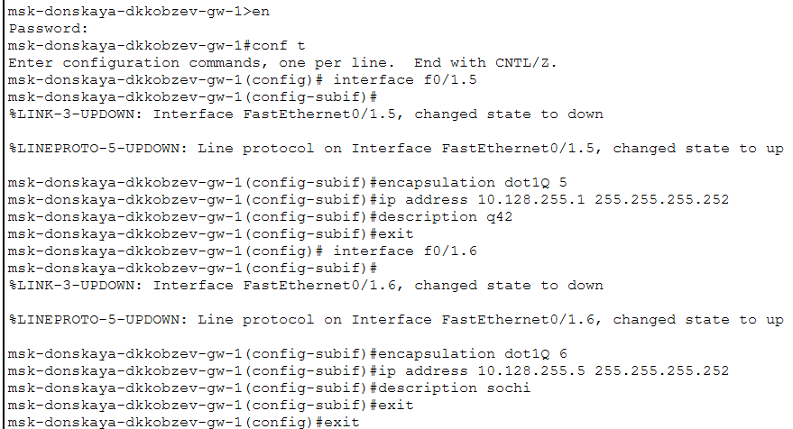
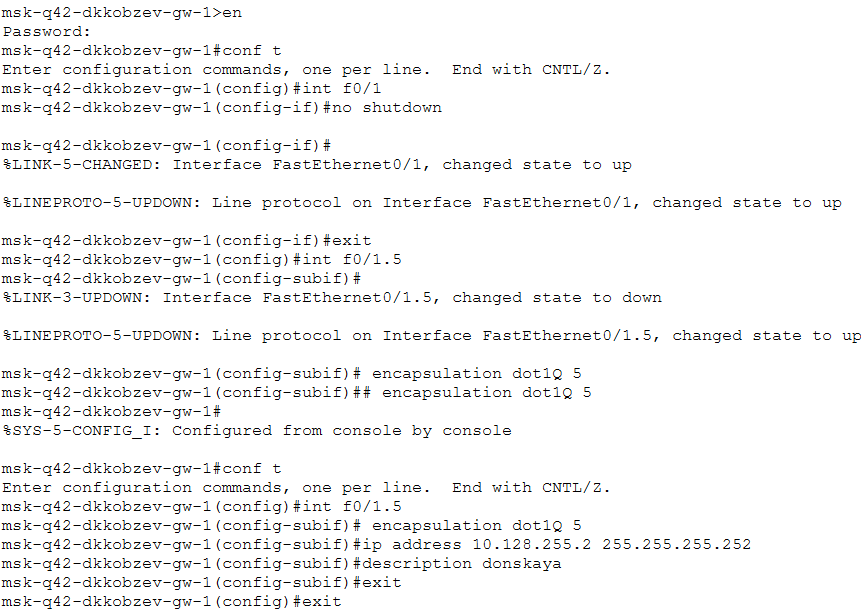
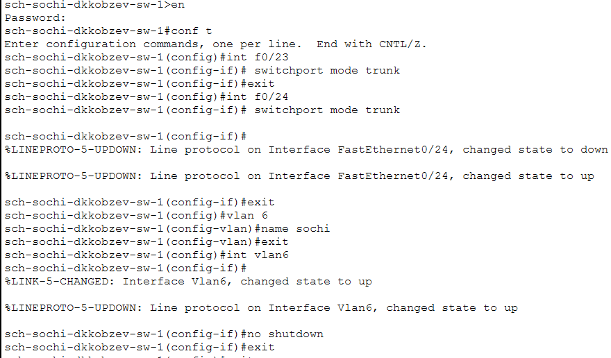
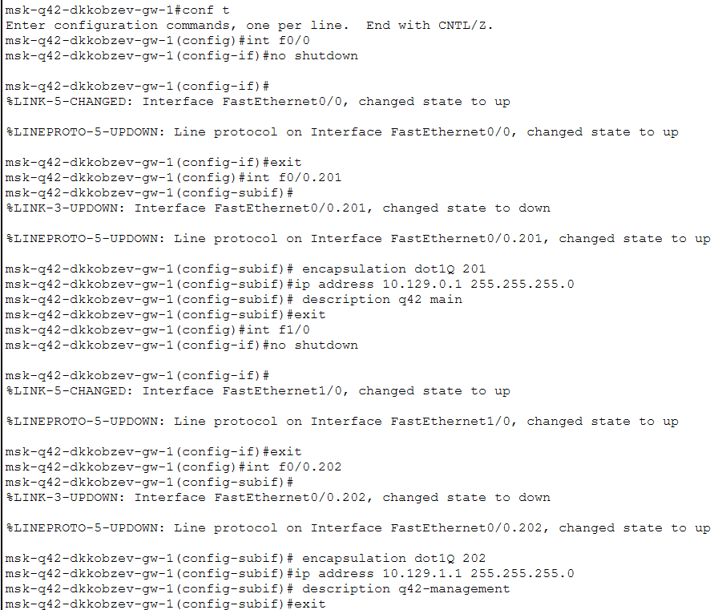
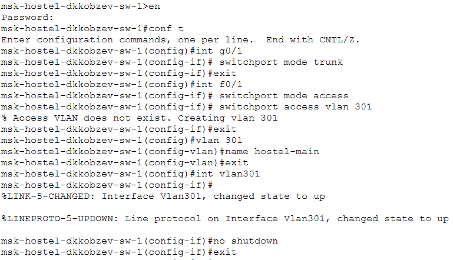
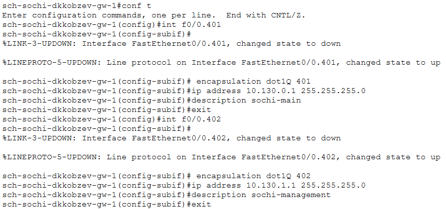
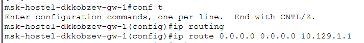
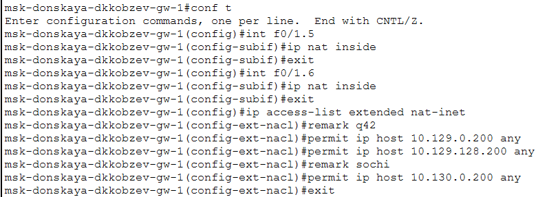

---
## Front matter
lang: ru-RU
title: Лабораторная работа
subtitle: Номер 14
author:
  - Кобзев Д. К. 
institute:
  - Российский университет дружбы народов, Москва, Россия
date: 16 мая 2026

## i18n babel
babel-lang: russian
babel-otherlangs: english

## Pdf output format
fontsize: 8pt

## Formatting pdf
toc: false
toc-title: Содержание
slide_level: 2
aspectratio: 169
section-titles: true
theme: metropolis
##Fonts
mainfont: Liberation Serif
sansfont: Liberation Sans
monofont: Liberation Mono
---

# Информация

## Докладчик

:::::::::::::: {.columns align=center}
::: {.column width="70%"}

  * Кобзев Дмитрий Константинович
  * Студент
  * Российский университет дружбы народов
  * НПИбд-01-23

:::
::: {.column width="30%"}

:::
::::::::::::::

## Цель работы

Целью данной работы является настройка взаимодействия через сеть провайдера посредством статической маршрутизации локальной сети организации с сетью основного здания, расположенного в 42-м квартале в Москве, и сетью филиала, расположенного в г. Сочи.

## Настройка линка между площадками

Настраиваем интерфейсы коммутатора provider-sw-1 (Рис. 1.1).

{height=60%}

## Настройка линка между площадками

Настраиваем интерфейсы коммутатора msk-donskaya-gw-1 (Рис. 1.2).

{height=60%}

## Настройка линка между площадками

Настраиваем интерфейсы маршрутизатора msk-q42-gw-1 (Рис. 1.3).

{height=60%}

## Настройка линка между площадками

Настраиваем интерфейсы коммутатора sch-sochi-sw-1 (Рис. 1.4)

{height=60%}

## Настройка линка между площадками

Настраиваем интерфейсы маршрутизатора sch-sochi-gw-1 (Рис. 1.5).

{height=60%}

## Настройка площадки 42-го квартала

Настраиваем интерфейсы маршрутизатора msk-q42-gw-1 (Рис. 1.6).

{height=60%}

## Настройка площадки 42-го квартала

Настраиваем интерфейсы коммутатора msk-q42-sw-1 (Рис. 1.7).

{height=60%}

## Настройка площадки 42-го квартала

Настраиваем интерфейсы маршрутизирующего коммутатора msk-hostel-gw-1 (Рис. 1.8).

{height=60%}

## Настройка площадки 42-го квартала

Настраиваем интерфейсы коммутатора msk-hostel-sw-1 (Рис. 1.9).

{height=60%}

## Настройка площадки в Сочи

Настраиваем интерфейсы маршрутизатора sch-sochi-gw-1 (Рис. 1.10).

{height=60%}

## Настройка площадки в Сочи

Настраиваем интерфейсы коммутатора sch-sochi-sw-1 (Рис. 1.11).

{height=60%}

## Настройка маршрутизации между площадками

Настраиваем маршрутизатор msk-donskaya-gw-1 (Рис. 1.12).

{height=60%}

## Настройка маршрутизации между площадками

Настраиваем маршрутизатор msk-q42-gw-1 (Рис. 1.13)

{height=60%}

## Настройка маршрутизации между площадками

Настраиваем маршрутизатор sch-sochi-gw-1 (Рис. 1.14).

{height=60%}

## Настройка маршрутизации на 42 квартале

Настраиваем маршрутизатор msk-q42-gw-1 (Рис. 1.15).

{height=60%}

## Настройка маршрутизации на 42 квартале

Настраиваем интерфейсы маршрутизирующего коммутатора msk-hostel-gw-1 (Рис. 1.16).

{height=60%}

## Настройка NAT на маршрутизаторе msk-donskaya-gw-1

Настраиваем NAT на маршрутизаторе msk-donskaya-gw-1 (Рис. 1.17).

{height=60%}

# Выводы

В результате выполнения лабораторной работы мною было настроено взаимодействие через сеть провайдера посредством статической маршрутизации локальной сети организации с сетью основного здания, расположенного в 42-м квартале в Москве, и сетью филиала, расположенного в г. Сочи.