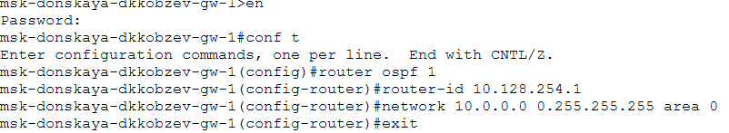
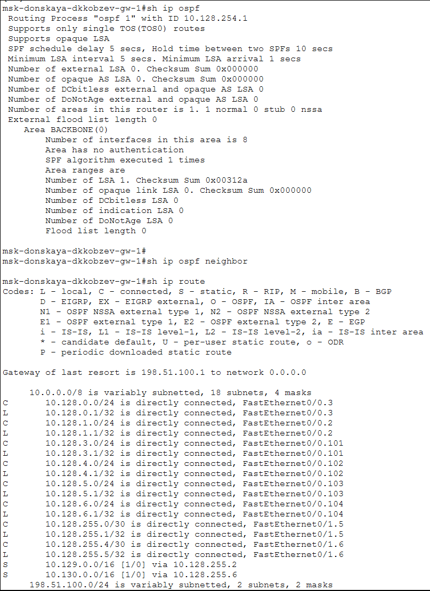
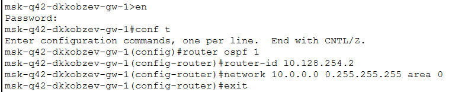
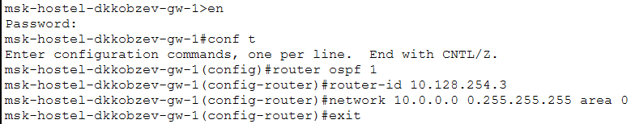
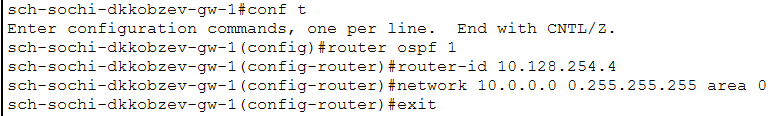
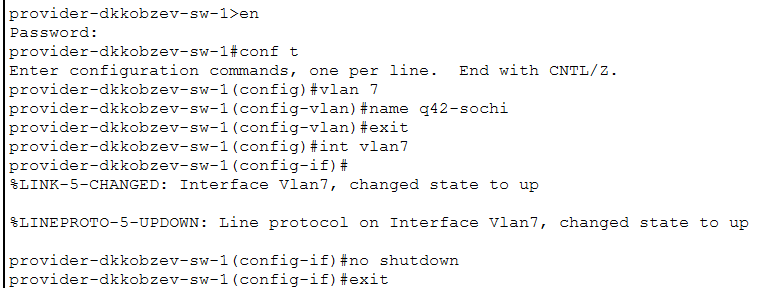
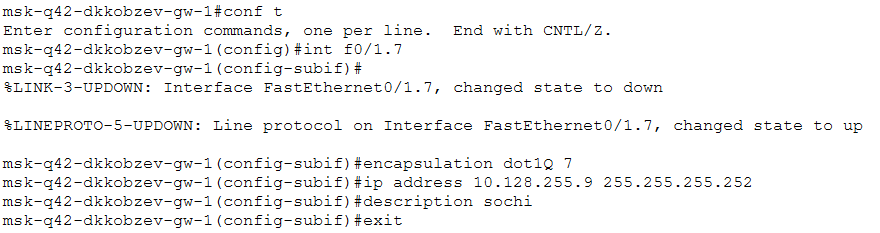
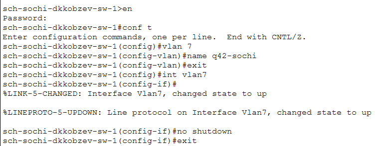
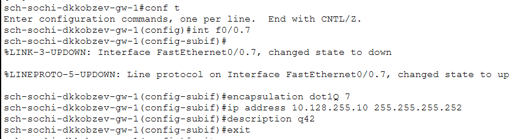

---
## Front matter
lang: ru-RU
title: Лабораторная работа
subtitle: Номер 15
author:
  - Кобзев Д. К. 
institute:
  - Российский университет дружбы народов, Москва, Россия
date: 22 мая 2026

## i18n babel
babel-lang: russian
babel-otherlangs: english

## Pdf output format
fontsize: 8pt

## Formatting pdf
toc: false
toc-title: Содержание
slide_level: 2
aspectratio: 169
section-titles: true
theme: metropolis
##Fonts
mainfont: Liberation Serif
sansfont: Liberation Sans
monofont: Liberation Mono
---

# Информация

## Докладчик

:::::::::::::: {.columns align=center}
::: {.column width="70%"}

  * Кобзев Дмитрий Константинович
  * Студент
  * Российский университет дружбы народов
  * НПИбд-01-23

:::
::: {.column width="30%"}

:::
::::::::::::::

## Цель работы

Целью данной работы является настройка динамической маршрутизации между территориями организации.

## Настройка OSPF

Настраиваем маршрутизатор msk-donskaya-gw-1 (Рис. 1.1).

{height=60%}

## Настройка OSPF

Проверяем состояние протокола OSPF на маршрутизаторе msk-donskaya-gw-1 (Рис. 1.2).

{height=60%}

## Настройка OSPF

Настраиваем маршрутизатор msk-q42-gw-1 (Рис. 1.3).

{height=60%}

## Настройка OSPF

Настраиваем маршрутизирующий коммутатор msk-hostel-gw-1 (Рис. 1.4)

{height=60%}

## Настройка OSPF

Настраиваем маршрутизатор sch-sochi-gw-1 (Рис. 1.5).

{height=60%}

## Настройка линка 42-й квартал–Сочи

Настраиваем интерфейсы коммутатора provider-sw-1 (Рис. 1.6).

{height=60%}

## Настройка линка 42-й квартал–Сочи

Настраиваем маршрутизатор msk-q42-gw-1 (Рис. 1.7).

{height=60%}

## Настройка линка 42-й квартал–Сочи

Настраиваем коммутатор sch-sochi-sw-1 (Рис. 1.8).

{height=60%}

## Настройка линка 42-й квартал–Сочи

Настраиваем маршрутизатор sch-sochi-gw-1 (Рис. 1.9).

{height=60%}

## Выводы

В результате выполнения лабораторной работы мною была настроена динамическая маршрутизация между территориями организации.