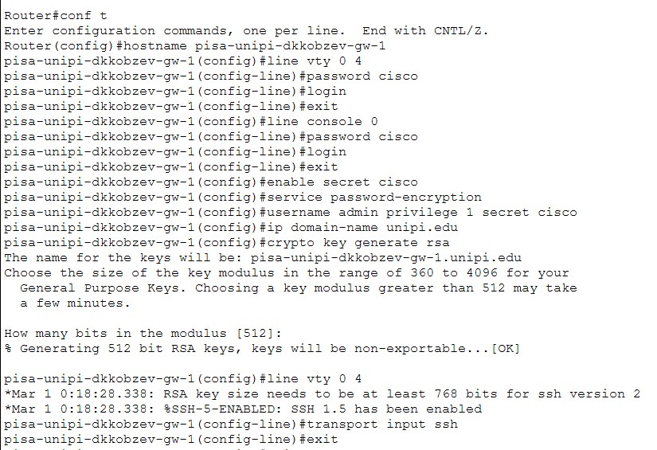
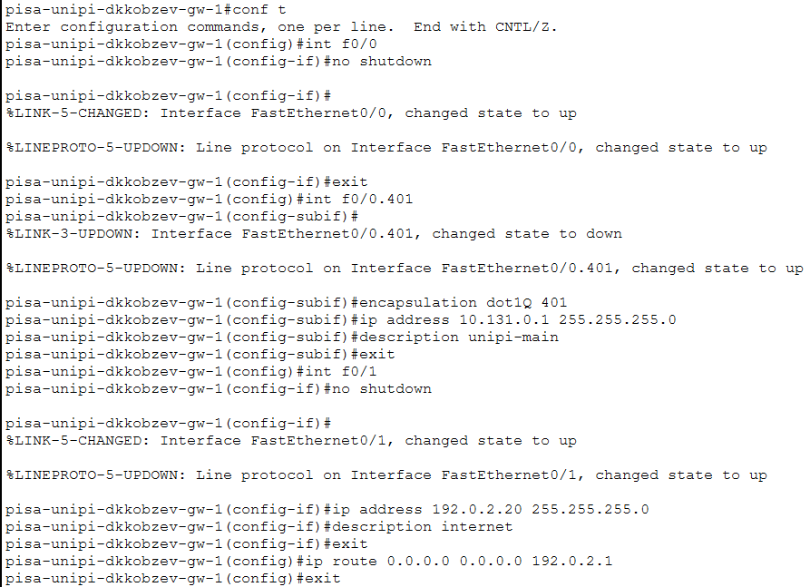

---
## Front matter
lang: ru-RU
title: Лабораторная работа
subtitle: Номер 16
author:
  - Кобзев Д. К. 
institute:
  - Российский университет дружбы народов, Москва, Россия
date: 30 мая 2026

## i18n babel
babel-lang: russian
babel-otherlangs: english

## Pdf output format
fontsize: 8pt

## Formatting pdf
toc: false
toc-title: Содержание
slide_level: 2
aspectratio: 169
section-titles: true
theme: metropolis
##Fonts
mainfont: Liberation Serif
sansfont: Liberation Sans
monofont: Liberation Mono
---

# Информация

## Докладчик

:::::::::::::: {.columns align=center}
::: {.column width="70%"}

  * Кобзев Дмитрий Константинович
  * Студент
  * Российский университет дружбы народов
  * НПИбд-01-23

:::
::: {.column width="30%"}

:::
::::::::::::::

## Цель работы

Целью данной работы является получение навыков настройки VPN-туннеля через незащищённое Интернет-соединение.

## Настройка VPN

Размещаем в рабочей области проекта в соответствии с модельными предположениями оборудование для сети Университета г. Пиза. (Рис. 1.1).

{height=60%}

## Настройка VPN

В физической рабочей области проекта создаем город Пиза, здание Университета г. Пиза. Перемещаем туда соответствующее оборудование. (Рис. 1.2).

{height=60%}

## Настройка площадки в г. Пиза

Выполняем первоначальную настройку и настройку интерфейсов оборудования сети Университета г. Пиза (Рис. 1.3), (Рис. 1.4), (Рис. 1.5), (Рис. 1.6).

{height=60%}

## Настройка площадки в г. Пиза

{height=60%}

## Настройка площадки в г. Пиза

{height=60%}

## Настройка площадки в г. Пиза

{height=60%}

## Настройка VPN на основе GRE

Настраиваем VPN на основе протокола GRE (Рис. 1.7), (Рис. 1.8).

{height=60%}

## Настройка VPN на основе GRE

{height=60%}

## Выводы

В результате выполнения лабораторной работы мною были получены навыки настройки VPN-туннеля через незащищённое Интернет-соединение.