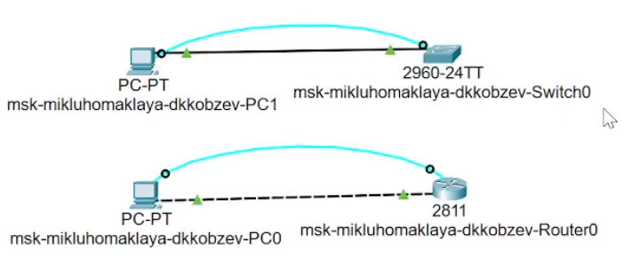
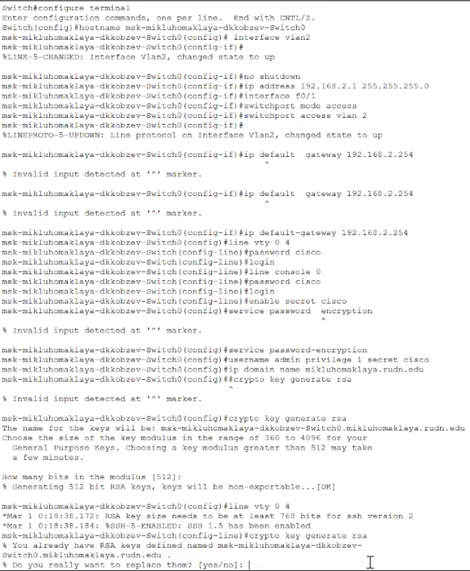
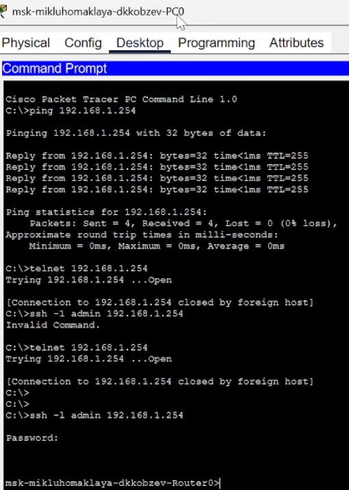
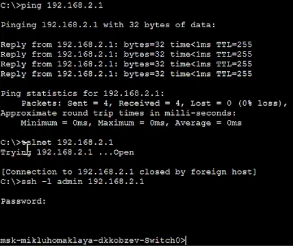

---
## Front matter
title: Лабораторная работа
subtitle: Номер 2
author: "Кобзев Д. К."

## Generic otions
lang: ru-RU
toc-title: "Содержание"

## Bibliography
bibliography: bib/cite.bib
csl: /home/dkkobzev/pandoc/csl/gost-r-7-0-5-2008-numeric.csl

## Pdf output format
toc: true # Table of contents
toc-depth: 2
lof: true # List of figures
lot: true # List of tables
fontsize: 12pt           # ← ИСПРАВЛЕНО: было 1pt, стало 12pt
linestretch: 1.5
papersize: a4
documentclass: scrreprt
## I18n polyglossia
polyglossia-lang:
  name: russian
  options:
    - spelling=modern
    - babelshorthands=true
polyglossia-otherlangs:
  name: english
## I18n babel
babel-lang: russian
babel-otherlangs: english
## Fonts
mainfont: Liberation Serif
romanfont: Liberation Serif
sansfont: Liberation Sans
monofont: Liberation Mono
# mathfont: Libertinus Math   # ← ЗАКОММЕНТИРОВАНО (временно)
mainfontoptions: Ligatures=Common,Ligatures=TeX,Scale=0.94
romanfontoptions: Ligatures=Common,Ligatures=TeX,Scale=0.94
sansfontoptions: Ligatures=Common,Ligatures=TeX,Scale=MatchLowercase,Scale=0.94
monofontoptions: Scale=MatchLowercase,Scale=0.94,FakeStretch=0.9

## Pandoc-crossref LaTeX customization
figureTitle: "Рис."
tableTitle: "Таблица"
listingTitle: "Листинг"
lofTitle: "Список иллюстраций"
lotTitle: "Список таблиц"
lolTitle: "Листинги"
## Misc options
indent: true
header-includes:
  - \usepackage{indentfirst}
  - \usepackage{float} # keep figures where there are in the text
  - \floatplacement{figure}{H} # keep figures where there are in the text
---

# Цель работы

Целью данной работы является получение основных навыков по начальному конфигурированию оборудования Cisco.

# Выполнение лабораторной работы

В логической рабочей области Packet Tracer размещаем коммутатор, маршрутизатор и 2 оконечных устройства типа PC, соединяем один PC с маршрутизатором, другой PC — с коммутатором (Рис. 1.1).

{height=60%}

Проводим настройку маршрутизатора в соответствии с заданием, ориентируясь на приведённую ниже часть конфигурации маршрутизатора  (Рис. 1.2).

{height=60%}

Проводим настройку коммутатора в соответствии с заданием, ориентируясьна приведённую ниже часть конфигурации коммутатора (Рис. 1.3).

{height=60%}

Проверяем работоспособность соединений с помощью команды ping. Пробуем подключиться к коммутатору и маршрутизатору разными способами: с помощью консольного кабеля, по протоколу удалённого доступа (telnet, ssh) (Рис. 1.4).

{height=60%}

{height=60%}

# Выводы

В результате выполнения лабораторной работы мною были получены основные навыки по начальному конфигурированию оборудования Cisco.

# Список литературы{.unnumbered}
