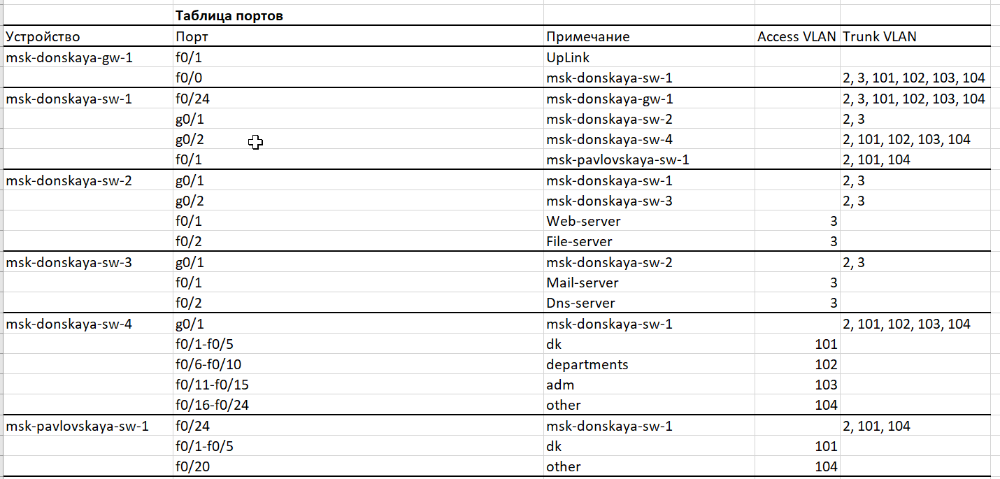
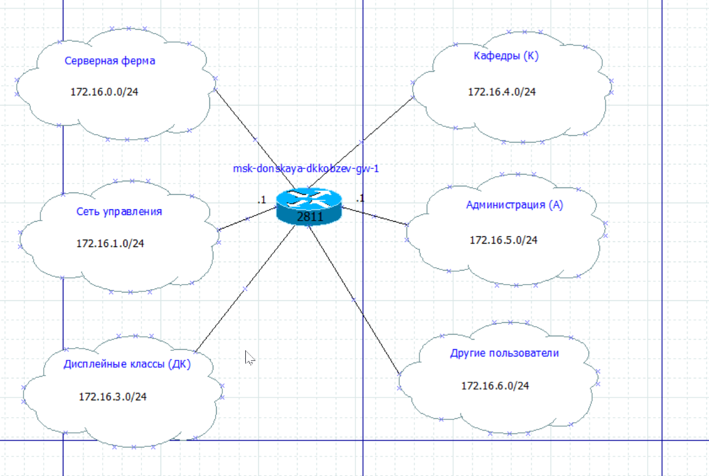
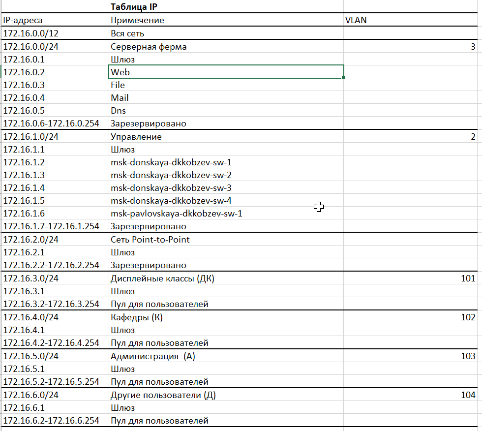
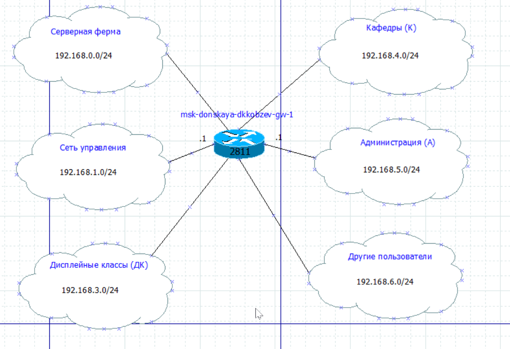
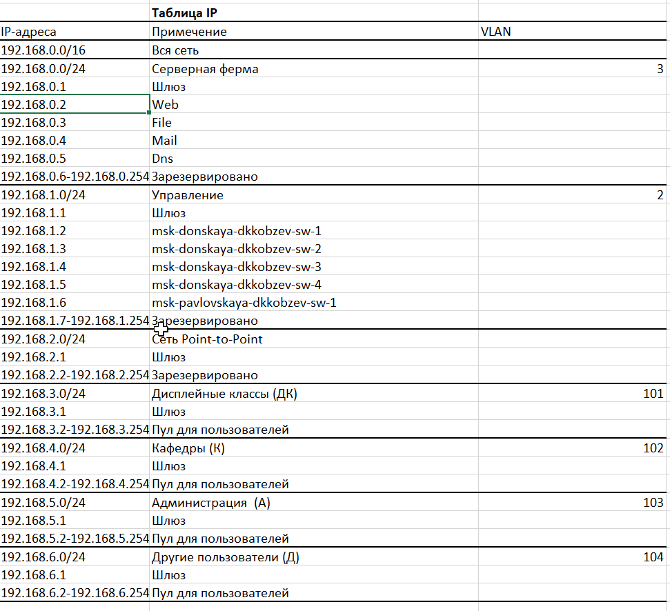

---
## Front matter
lang: ru-RU
title: Лабораторная работа
subtitle: Номер 3
author:
  - Кобзев Д. К. 
institute:
  - Российский университет дружбы народов, Москва, Россия
date: 28 февраля 2026

## i18n babel
babel-lang: russian
babel-otherlangs: english

## Pdf output format
fontsize: 8pt

## Formatting pdf
toc: false
toc-title: Содержание
slide_level: 2
aspectratio: 169
section-titles: true
theme: metropolis
##Fonts
mainfont: Liberation Serif
sansfont: Liberation Sans
monofont: Liberation Mono
---

# Информация

## Докладчик

:::::::::::::: {.columns align=center}
::: {.column width="70%"}

  * Кобзев Дмитрий Константинович
  * Студент
  * Российский университет дружбы народов
  * НПИбд-01-23

:::
::: {.column width="30%"}

:::
::::::::::::::

## Цель работы

Целью данной работы является ознакомление с принципами планирования локальной сети организации.

## Планирование локальной сети организации

Используя графический редактор Dia, повторяем схемы L1, L2, L3, а также сопутствующие им таблицы VLAN, IP-адресов и портов подключения оборудования планируемой сети (Рис. 1.1), (Рис. 1.2), (Рис. 1.3), (Рис. 1.4), (Рис. 1.5), (Рис. 1.6), (Рис. 1.7).

{height=60%}

## Планирование локальной сети организации

{height=60%}

## Планирование локальной сети организации

{height=60%}

## Планирование локальной сети организации

{height=60%}

## Планирование локальной сети организации

{height=60%}

## Планирование локальной сети организации

{height=60%}

## Планирование локальной сети организации

{height=60%}

## Планирование локальной сети организации

Делаем аналогичный план адресного пространства для сетей 172.16.0.0/12 и 192.168.0.0/16 с соответствующими схемами сети и сопутствующей таблицей IP-адресов (Рис. 1.8), (Рис. 1.9), (Рис. 1.10), (Рис. 1.11).

{height=60%}

## Планирование локальной сети организации

{height=60%}

## Планирование локальной сети организации

{height=60%}

## Планирование локальной сети организации

{height=60%}\

## Выводы

В результате выполнения лабораторной работы я был ознакомлен с принципами планирования локальной сети организации.