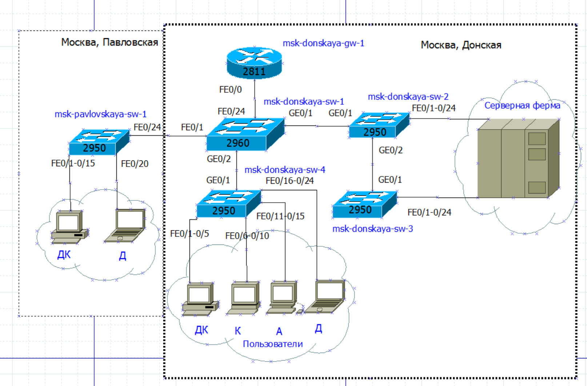
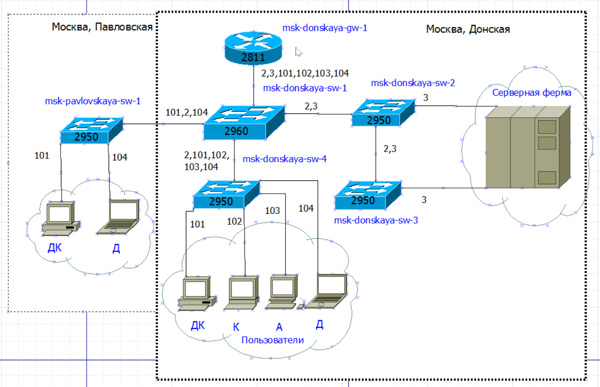
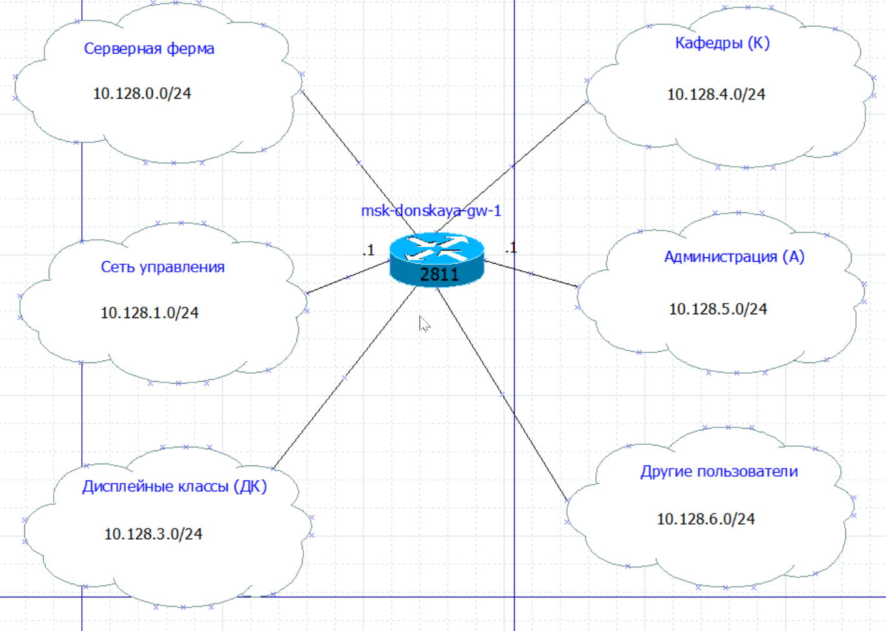
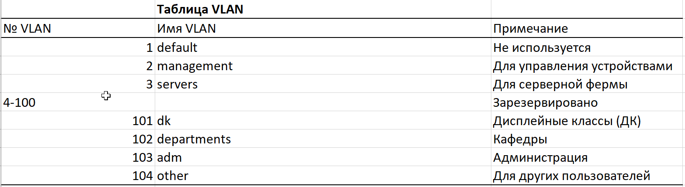
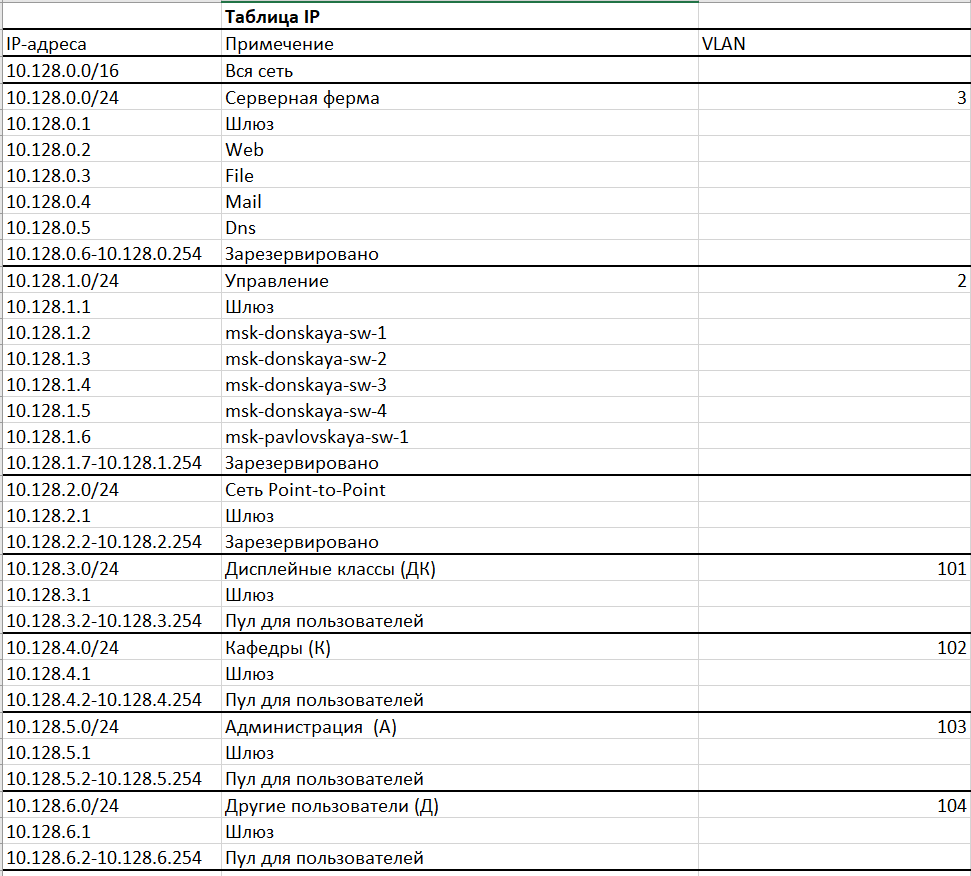
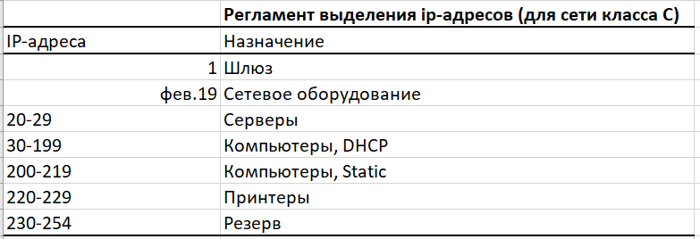

---
## Front matter
title: Лабораторная работа
subtitle: Номер 3
author: "Кобзев Д. К."

## Generic otions
lang: ru-RU
toc-title: "Содержание"

## Bibliography
bibliography: bib/cite.bib
csl: /home/dkkobzev/pandoc/csl/gost-r-7-0-5-2008-numeric.csl

## Pdf output format
toc: true # Table of contents
toc-depth: 2
lof: true # List of figures
lot: true # List of tables
fontsize: 12pt
linestretch: 1.5
papersize: a4
documentclass: scrreprt
## I18n polyglossia
polyglossia-lang:
  name: russian
  options:
    - spelling=modern
    - babelshorthands=true
polyglossia-otherlangs:
  name: english
## I18n babel
babel-lang: russian
babel-otherlangs: english
## Fonts
mainfont: Liberation Serif
romanfont: Liberation Serif
sansfont: Liberation Sans
monofont: Liberation Mono
# mathfont: Libertinus Math   # ← ЗАКОММЕНТИРОВАНО (временно)
mainfontoptions: Ligatures=Common,Ligatures=TeX,Scale=0.94
romanfontoptions: Ligatures=Common,Ligatures=TeX,Scale=0.94
sansfontoptions: Ligatures=Common,Ligatures=TeX,Scale=MatchLowercase,Scale=0.94
monofontoptions: Scale=MatchLowercase,Scale=0.94,FakeStretch=0.9

## Pandoc-crossref LaTeX customization
figureTitle: "Рис."
tableTitle: "Таблица"
listingTitle: "Листинг"
lofTitle: "Список иллюстраций"
lotTitle: "Список таблиц"
lolTitle: "Листинги"
## Misc options
indent: true
header-includes:
  - \usepackage{indentfirst}
  - \usepackage{float} # keep figures where there are in the text
  - \floatplacement{figure}{H} # keep figures where there are in the text
---

# Цель работы

Целью данной работы является ознакомление с принципами планирования локальной сети организации.

# Выполнение лабораторной работы

Используя графический редактор Dia, повторяем схемы L1, L2, L3, а также сопутствующие им таблицы VLAN, IP-адресов и портов подключения оборудования планируемой сети (Рис. 1.1), (Рис. 1.2), (Рис. 1.3), (Рис. 1.4), (Рис. 1.5), (Рис. 1.6), (Рис. 1.7).

{height=60%}

{height=60%}

{height=60%}

{height=60%}

{height=60%}

{height=60%}

{height=60%}

Делаем аналогичный план адресного пространства для сетей 172.16.0.0/12 и 192.168.0.0/16 с соответствующими схемами сети и сопутствующей таблицей IP-адресов (Рис. 1.8), (Рис. 1.9), (Рис. 1.10), (Рис. 1.11).

{height=60%}

{height=60%}

{height=60%}

{height=60%}

# Выводы

В результате выполнения лабораторной работы я был ознакомлен с принципами планирования локальной сети организации.

# Список литературы{.unnumbered}
