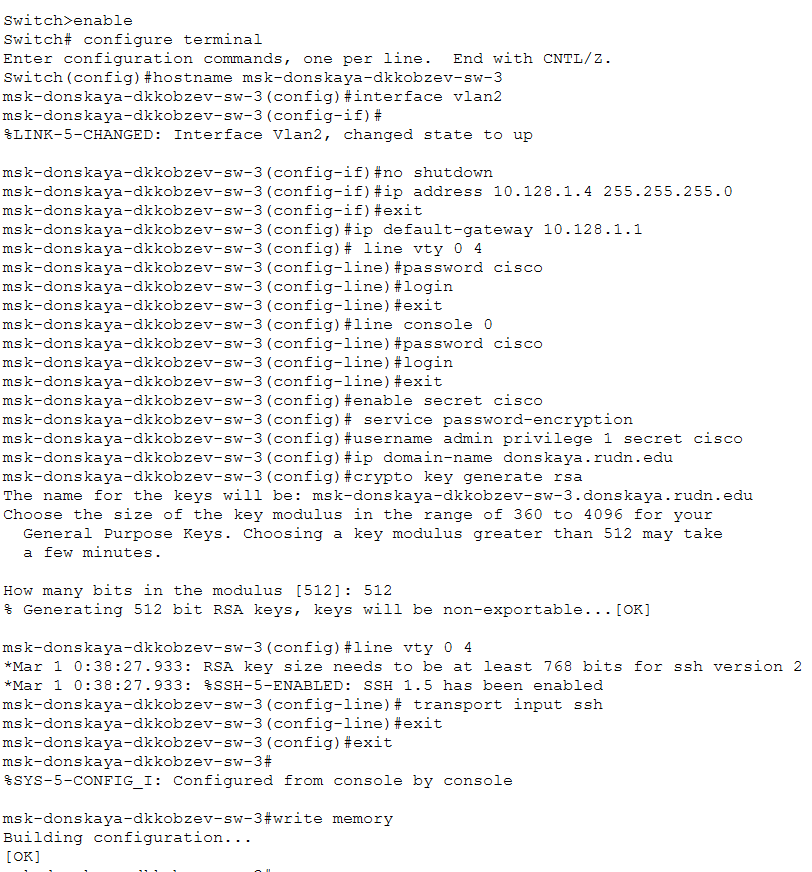
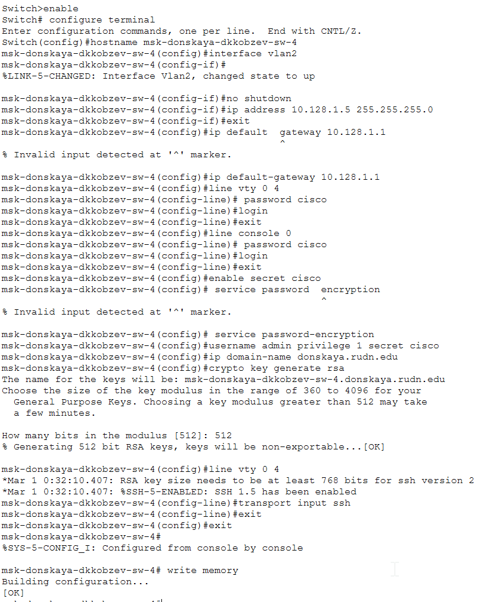
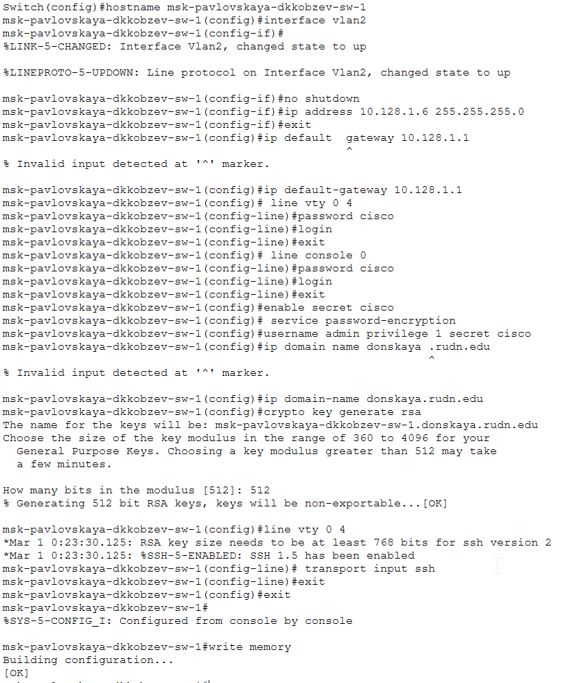

---
## Front matter
lang: ru-RU
title: Лабораторная работа
subtitle: Номер 4
author:
  - Кобзев Д. К. 
institute:
  - Российский университет дружбы народов, Москва, Россия
date: 7 марта 2026

## i18n babel
babel-lang: russian
babel-otherlangs: english

## Pdf output format
fontsize: 8pt

## Formatting pdf
toc: false
toc-title: Содержание
slide_level: 2
aspectratio: 169
section-titles: true
theme: metropolis
##Fonts
mainfont: Liberation Serif
sansfont: Liberation Sans
monofont: Liberation Mono
---

# Информация

## Докладчик

:::::::::::::: {.columns align=center}
::: {.column width="70%"}

  * Кобзев Дмитрий Константинович
  * Студент
  * Российский университет дружбы народов
  * НПИбд-01-23

:::
::: {.column width="30%"}

:::
::::::::::::::

## Цель работы

Целью данной работы является проведение подготовительной работы по первоначальной настройке коммутаторов сети.

## Первоначальное конфигурирование сети

В логической рабочей области Packet Tracer размещаем коммутаторы и оконечные устройства согласно схеме сети L1 и соединяем их через соответствующие интерфейсы (Рис. 1.1).

{height=60%}

## Первоначальное конфигурирование сети

Используя типовую конфигурацию коммутатора, настраиваем все коммутаторы, изменяя название устройства и его IP-адрес согласно плану IP (Рис. 1.2), (Рис. 1.3), (Рис. 1.4), (Рис. 1.5), (Рис. 1.6).

{height=60%}

## Первоначальное конфигурирование сети

{height=60%}

## Первоначальное конфигурирование сети

{height=60%}

## Первоначальное конфигурирование сети

{height=60%}

## Первоначальное конфигурирование сети

{height=60%}

## Выводы

В результате выполнения лабораторной работы мною была проведена подготовительная работа по первоначальной настройке коммутаторов сети.