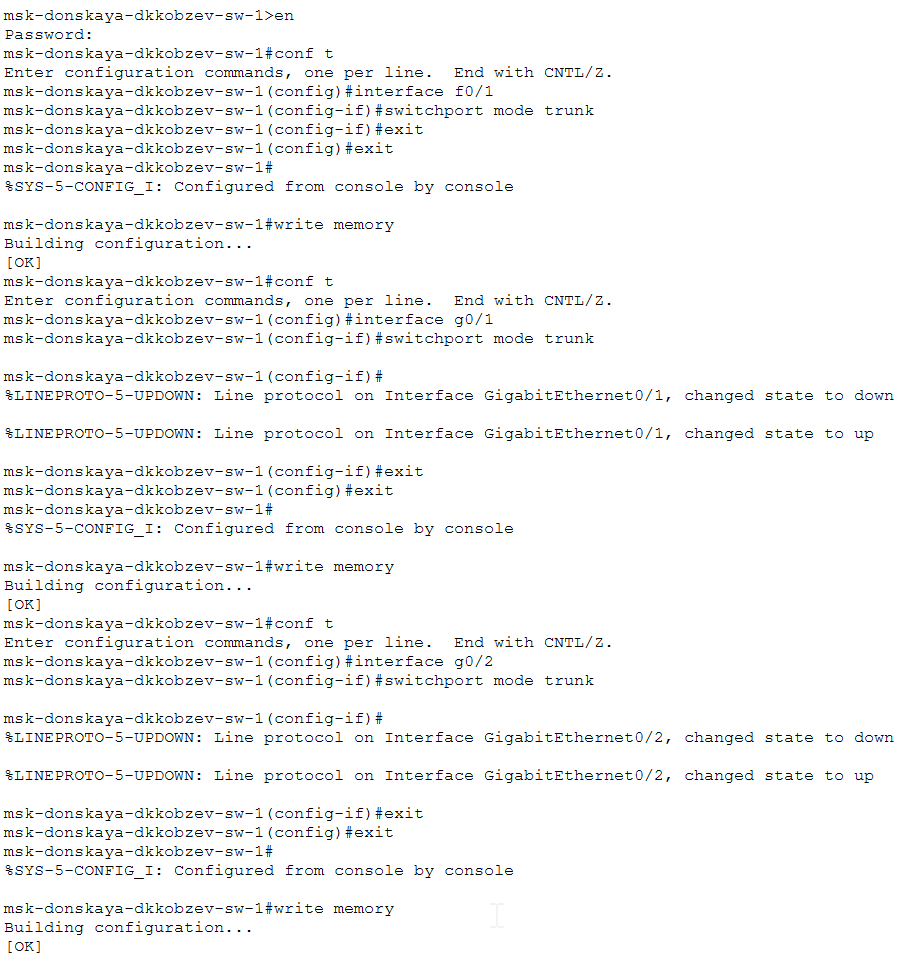
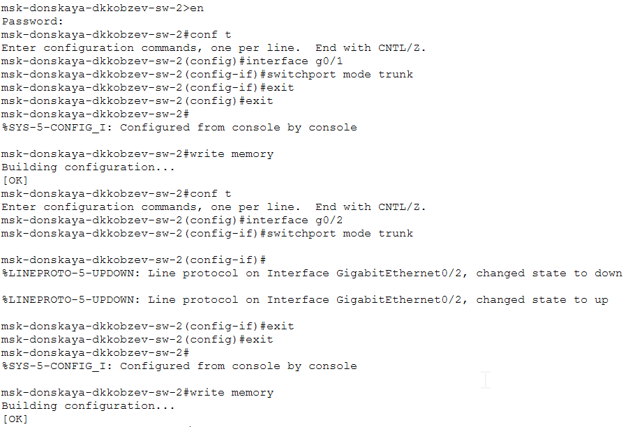
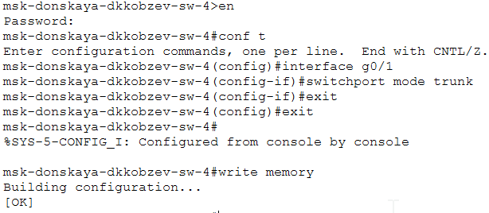
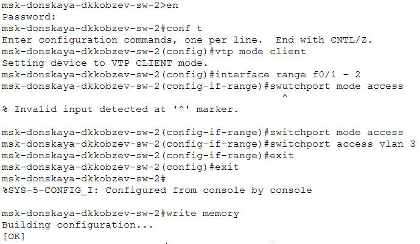
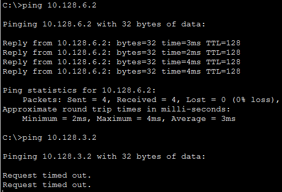

---
## Front matter
lang: ru-RU
title: Лабораторная работа
subtitle: Номер 5
author:
  - Кобзев Д. К. 
institute:
  - Российский университет дружбы народов, Москва, Россия
date: 14 марта 2026

## i18n babel
babel-lang: russian
babel-otherlangs: english

## Pdf output format
fontsize: 8pt

## Formatting pdf
toc: false
toc-title: Содержание
slide_level: 2
aspectratio: 169
section-titles: true
theme: metropolis
##Fonts
mainfont: Liberation Serif
sansfont: Liberation Sans
monofont: Liberation Mono
---

# Информация

## Докладчик

:::::::::::::: {.columns align=center}
::: {.column width="70%"}

  * Кобзев Дмитрий Константинович
  * Студент
  * Российский университет дружбы народов
  * НПИбд-01-23

:::
::: {.column width="30%"}

:::
::::::::::::::

## Цель работы

Целью данной работы является получение основных навыков по настройке VLAN на коммутаторах сети.

## Конфигурация Trunk-порта

Используя приведённую последовательность команд из примера по конфигурации Trunk-порта, настраиваем Trunk-порты на соответствующих интерфейсах всех коммутаторов (Рис. 1.1), (Рис. 1.2), (Рис. 1.3), (Рис. 1.4), (Рис. 1.5)

{height=60%}

## Конфигурация Trunk-порта

{height=60%}

## Конфигурация Trunk-порта

{height=60%}

## Конфигурация Trunk-порта

{height=60%}

## Конфигурация Trunk-порта

{height=60%}

## Конфигурация VTP

Используя приведённую последовательность команд по конфигурации VTP, настраиваем коммутатор msk-donskaya-sw-1 как VTP-сервер и прописываем на нём номера и названия VLAN (Рис. 1.6).

{height=60%}

## Конфигурация диапазона портов

Используя приведённую последовательность команд по конфигурации диапазонов портов, настраиваем коммутаторы msk-donskaya-sw-2 — msk-donskaya-sw-4, msk-pavlovskaya-sw-1 как VTP-клиенты и на интерфейсах указываем принадлежность к VLAN (Рис. 1.7), (Рис. 1.8), (Рис. 1.9), (Рис. 1.10).

{height=60%}

## Конфигурация диапазона портов

{height=60%}

## Конфигурация диапазона портов

{height=60%}

## Конфигурация диапазона портов

{height=60%}

## Конфигурирование VLAN

После указания статических IP-адресов на оконечных устройствах проверяем с помощью команды ping доступность устройств, принадлежащих одному VLAN, и недоступность устройств, принадлежащих разным VLAN (Рис. 1.11).

{height=60%}

## Выводы

В результате выполнения лабораторной работы мною были получены основные навыки по настройке VLAN на коммутаторах сети.