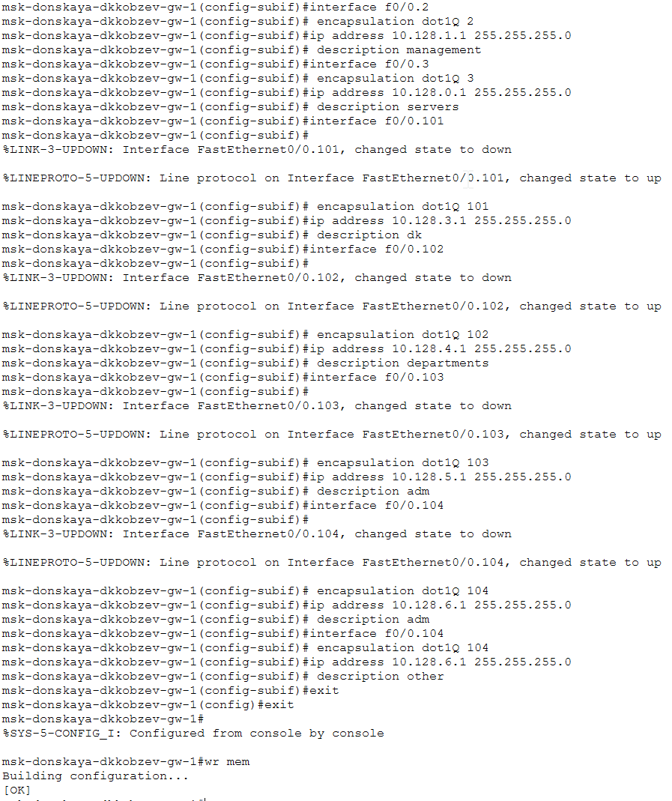

---
## Front matter
lang: ru-RU
title: Лабораторная работа
subtitle: Номер 6
author:
  - Кобзев Д. К. 
institute:
  - Российский университет дружбы народов, Москва, Россия
date: 21 марта 2026

## i18n babel
babel-lang: russian
babel-otherlangs: english

## Pdf output format
fontsize: 8pt

## Formatting pdf
toc: false
toc-title: Содержание
slide_level: 2
aspectratio: 169
section-titles: true
theme: metropolis
##Fonts
mainfont: Liberation Serif
sansfont: Liberation Sans
monofont: Liberation Mono
---

# Информация

## Докладчик

:::::::::::::: {.columns align=center}
::: {.column width="70%"}

  * Кобзев Дмитрий Константинович
  * Студент
  * Российский университет дружбы народов
  * НПИбд-01-23

:::
::: {.column width="30%"}

:::
::::::::::::::

## Цель работы

Целью данной работы является настройка статической маршрутизации VLAN в сети.

## Статическая маршрутизация VLAN

В логической области проекта размещаем маршрутизатор Cisco 2811, подключаем его к порту 24 коммутатора msk-donskaya-sw-1 в соответствии с таблицей портов (Рис. 1.1).

{height=60%}

## Статическая маршрутизация VLAN

Используя приведённую последовательность команд по первоначальной настройке маршрутизатора, конфигурируем маршрутизатор, задав на нём имя, пароль для доступа к консоли, настраиваем удалённое подключение к нему по ssh (Рис. 1.2).

{height=60%}

## Статическая маршрутизация VLAN

Настраиваем порт 24 коммутатора msk-donskaya-sw-1 как trunk-порт (Рис. 1.3).

{height=60%}

## Статическая маршрутизация VLAN

На интерфейсе f0/0 маршрутизатора msk-donskaya-gw-1 настройте виртуальные интерфейсы, соответствующие номерам VLAN. Согласно таблице IP-адресов задаем соответствующие IP-адреса на виртуальных интерфейсах. Для этого используем приведённую последовательность команд по конфигурации VLAN-интерфейсов маршрутизатора (Рис. 1.4).

{height=60%}

## Статическая маршрутизация VLAN

Проверяем доступность оконечных устройств из разных VLAN (Рис. 1.5).

{height=60%}

## Выводы

В результате выполнения лабораторной работы мною была настроена статическая маршрутизации VLAN в сети.