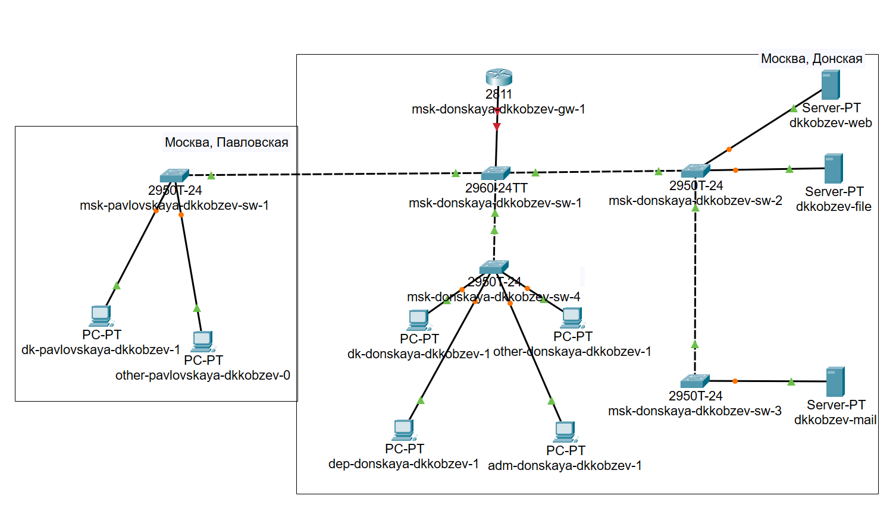
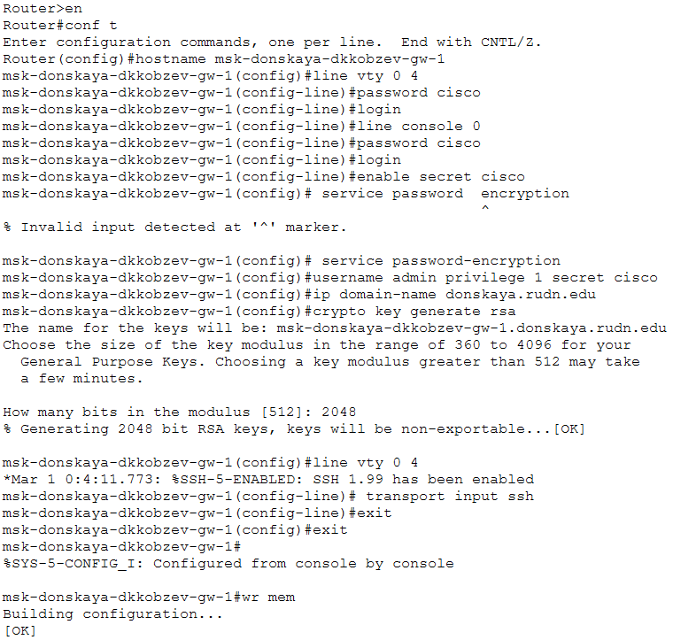
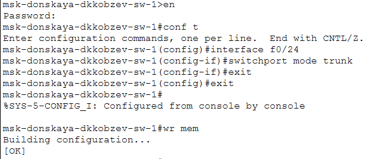
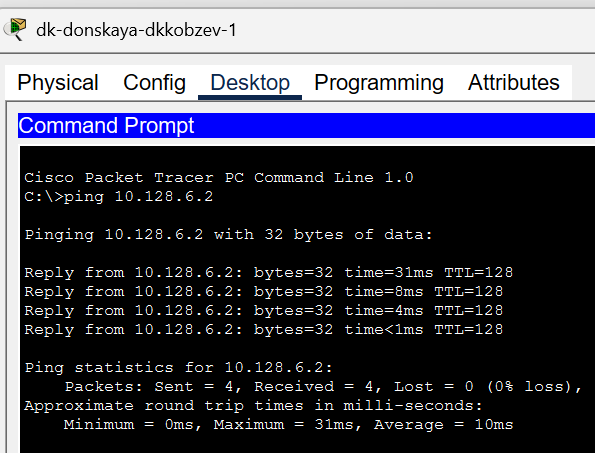

---
## Front matter
title: Лабораторная работа
subtitle: Номер 6
author: "Кобзев Д. К."

## Generic otions
lang: ru-RU
toc-title: "Содержание"

## Bibliography
bibliography: bib/cite.bib
csl: /home/dkkobzev/pandoc/csl/gost-r-7-0-5-2008-numeric.csl

## Pdf output format
toc: true # Table of contents
toc-depth: 2
lof: true # List of figures
lot: true # List of tables
fontsize: 12pt
linestretch: 1.5
papersize: a4
documentclass: scrreprt
## I18n polyglossia
polyglossia-lang:
  name: russian
  options:
    - spelling=modern
    - babelshorthands=true
polyglossia-otherlangs:
  name: english
## I18n babel
babel-lang: russian
babel-otherlangs: english
## Fonts
mainfont: Liberation Serif
romanfont: Liberation Serif
sansfont: Liberation Sans
monofont: Liberation Mono
# mathfont: Libertinus Math
mainfontoptions: Ligatures=Common,Ligatures=TeX,Scale=0.94
romanfontoptions: Ligatures=Common,Ligatures=TeX,Scale=0.94
sansfontoptions: Ligatures=Common,Ligatures=TeX,Scale=MatchLowercase,Scale=0.94
monofontoptions: Scale=MatchLowercase,Scale=0.94,FakeStretch=0.9

## Pandoc-crossref LaTeX customization
figureTitle: "Рис."
tableTitle: "Таблица"
listingTitle: "Листинг"
lofTitle: "Список иллюстраций"
lotTitle: "Список таблиц"
lolTitle: "Листинги"
## Misc options
indent: true
header-includes:
  - \usepackage{indentfirst}
  - \usepackage{float} # keep figures where there are in the text
  - \floatplacement{figure}{H} # keep figures where there are in the text
---

# Цель работы

Целью данной работы является настройка статической маршрутизации VLAN в сети.

# Выполнение лабораторной работы

В логической области проекта размещаем маршрутизатор Cisco 2811, подключаем его к порту 24 коммутатора msk-donskaya-sw-1 в соответствии с таблицей портов (Рис. 1.1).

{height=60%}

Используя приведённую последовательность команд по первоначальной настройке маршрутизатора, конфигурируем маршрутизатор, задав на нём имя, пароль для доступа к консоли, настраиваем удалённое подключение к нему по ssh (Рис. 1.2).

{height=60%}

Настраиваем порт 24 коммутатора msk-donskaya-sw-1 как trunk-порт (Рис. 1.3).

{height=60%}

На интерфейсе f0/0 маршрутизатора msk-donskaya-gw-1 настройте виртуальные интерфейсы, соответствующие номерам VLAN. Согласно таблице IP-адресов задаем соответствующие IP-адреса на виртуальных интерфейсах. Для этого используем приведённую последовательность команд по конфигурации VLAN-интерфейсов маршрутизатора (Рис. 1.4).

{height=60%}

Проверяем доступность оконечных устройств из разных VLAN (Рис. 1.5).

{height=60%}

# Выводы

В результате выполнения лабораторной работы мною была настроена статическая маршрутизации VLAN в сети.

# Список литературы{.unnumbered}
