---
## Front matter
lang: ru-RU
title: Лабораторная работа
subtitle: Номер 7
author:
  - Кобзев Д. К. 
institute:
  - Российский университет дружбы народов, Москва, Россия
date: 28 марта 2026

## i18n babel
babel-lang: russian
babel-otherlangs: english

## Pdf output format
fontsize: 8pt

## Formatting pdf
toc: false
toc-title: Содержание
slide_level: 2
aspectratio: 169
section-titles: true
theme: metropolis
##Fonts
mainfont: Liberation Serif
sansfont: Liberation Sans
monofont: Liberation Mono
---

# Информация

## Докладчик

:::::::::::::: {.columns align=center}
::: {.column width="70%"}

  * Кобзев Дмитрий Константинович
  * Студент
  * Российский университет дружбы народов
  * НПИбд-01-23

:::
::: {.column width="30%"}

:::
::::::::::::::

## Цель работы

Целью данной работы является получение навыков работы с физической рабочей областью Packet Tracer, с учетом физических параметров сети.

## Учёт физических параметров сети

Открываем проект предыдущей лабораторной работы.
Переходим в физическую рабочую область Packet Tracer. Присваиваем название городу — Moscow (Рис. 1.1).

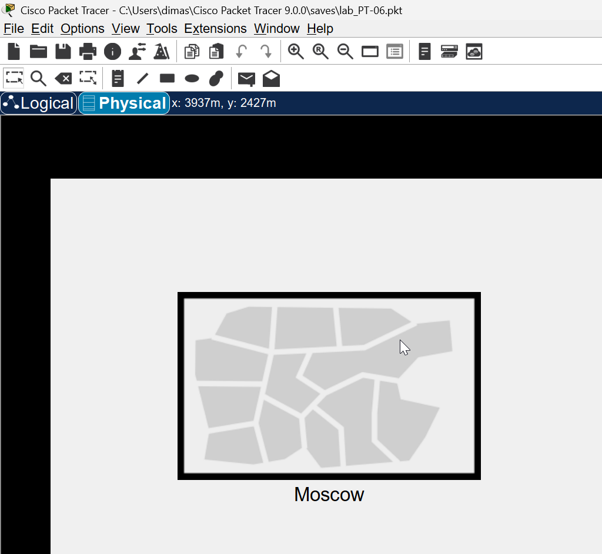{height=60%}

## Учёт физических параметров сети

Щёлкнув на изображении города, видим изображение здания. Присваиваем ему название Donskaya. Добавляем здание для территории Pavlovskaya (Рис. 1.2).

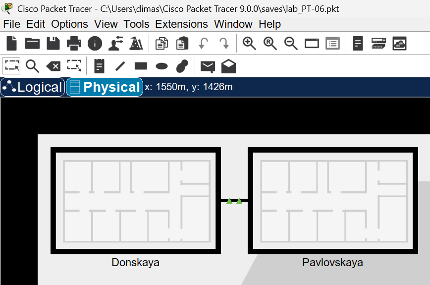{height=60%}

## Учёт физических параметров сети

Щёлкнув на изображении здания Donskaya, перемещаем изображение, обозначающее серверное помещение, в него (Рис. 1.3).

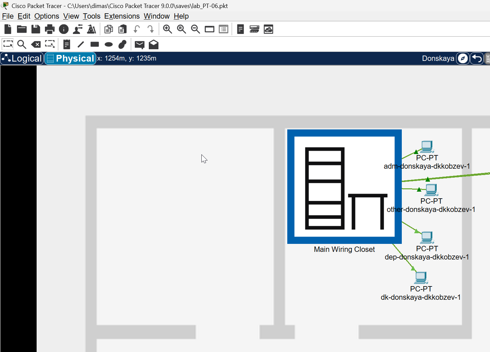{height=60%}

## Учёт физических параметров сети

Щёлкнув на изображении серверной, видим отображение серверных стоек (Рис. 1.4).

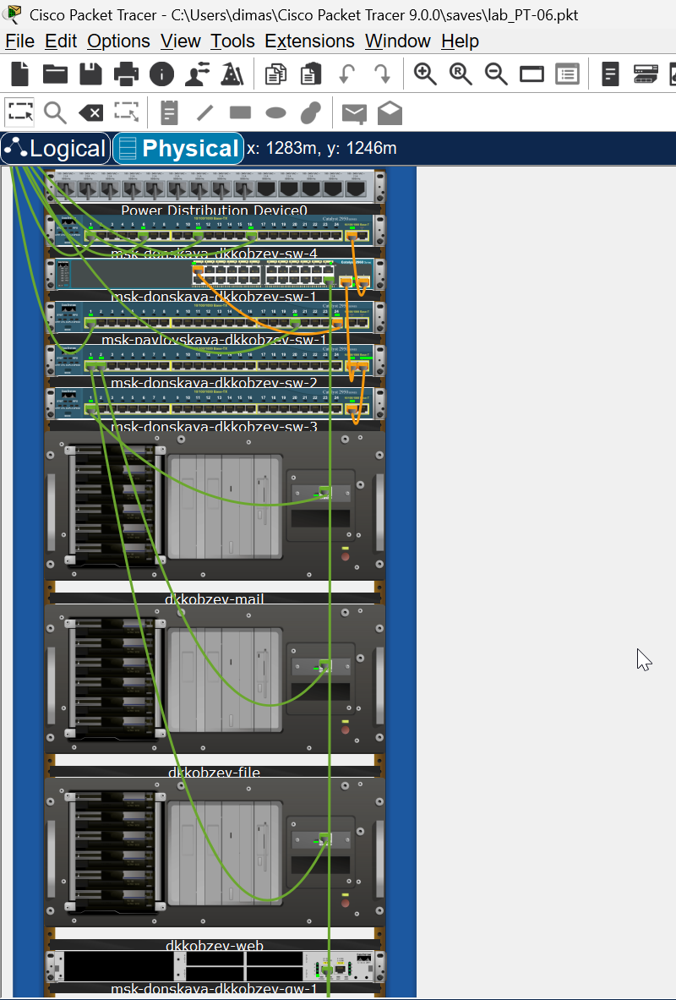{height=60%}

## Учёт физических параметров сети

Перемещаем коммутатор msk-pavlovskaya-sw-1 и два оконечных устройства dk-pavlovskaya-1 и other-pavlovskaya-1 на территорию Pavlovskaya,
используя меню Move физической рабочей области Packet Tracer (Рис. 1.5).

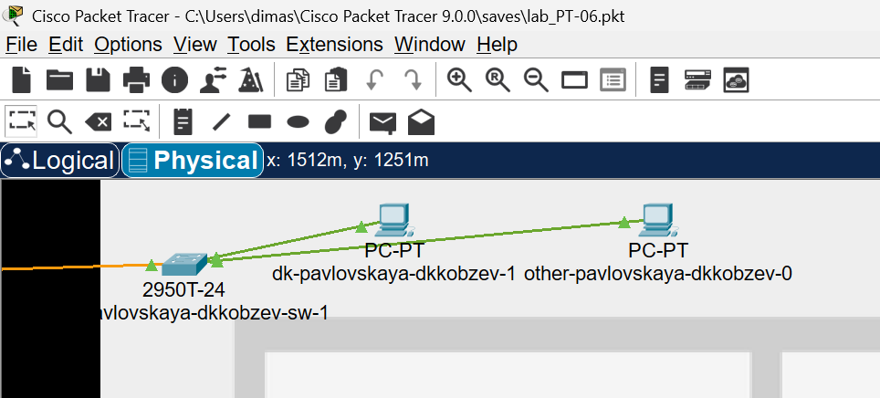{height=60%}

## Учёт физических параметров сети

Вернувшись в логическую рабочую область Packet Tracer, пингуем с коммутатора msk-donskaya-sw-1 коммутатор msk-pavlovskaya-sw-1. Убеждаемся в работоспособности соединения (Рис. 1.6).

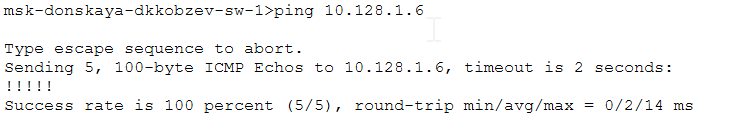{height=60%}

## Учёт физических параметров сети

В меню Options , Preferences во вкладке Interface активируем разрешение на учёт физических характеристик среды передачи (Рис. 1.7).

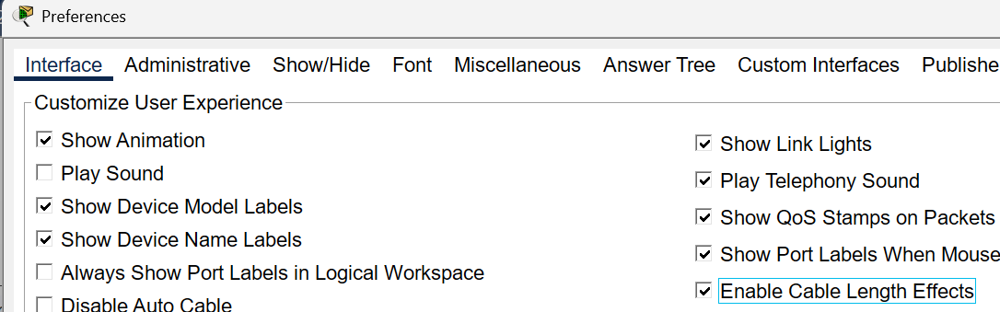{height=60%}

## Учёт физических параметров сети

В физической рабочей области Packet Tracer размещаем две территории на расстоянии более 100 м друг от друга  (Рис. 1.8).

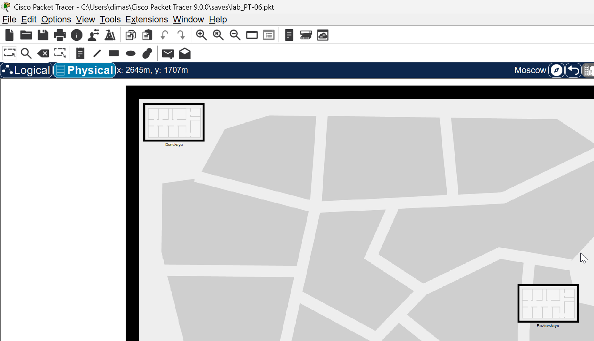{height=60%}

## Учёт физических параметров сети

Вернувшись в логическую рабочую область Packet Tracer, пингуем с коммутатора msk-donskaya-sw-1 коммутатор msk-pavlovskaya-sw-1. Убеждаемся в неработоспособности соединения (Рис. 1.9).

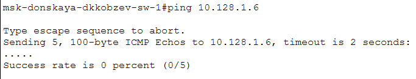{height=60%}

## Учёт физических параметров сети

Удаляем соединение между msk-donskaya-sw-1 и msk-pavlovskaya-sw-1. Добавляем в логическую рабочую область два повторителя. Присваиваем им соответствующие названия msk-donskaya-mc-1 и msk-pavlovskaya-mc-1. Заменяем имеющиеся модули на PT-REPEATER-
NM-1FFE и PT-REPEATER-NM-1CFE для подключения оптоволокна и витой пары по технологии Fast Ethernet (Рис. 1.10).

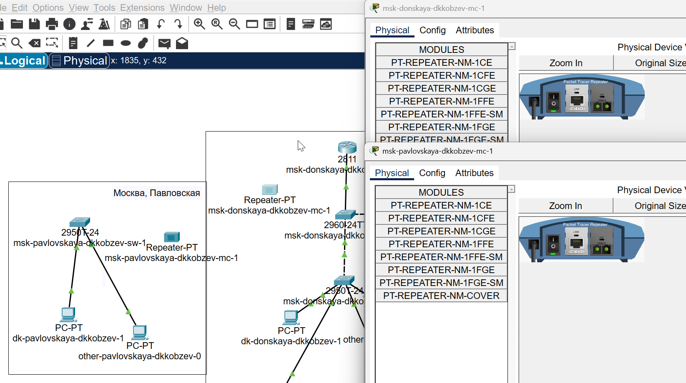{height=60%}

## Учёт физических параметров сети

Перемещаем msk-pavlovskaya-mc-1 на территорию Pavlovskaya (Рис. 1.11).

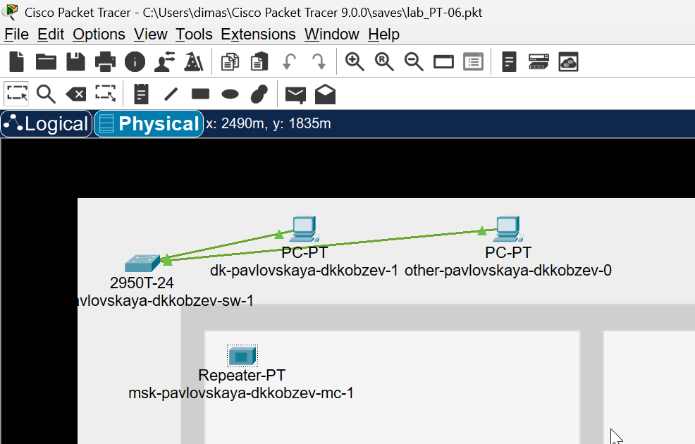{height=60%}

## Учёт физических параметров сети

Подключаем коммутатор msk-donskaya-sw-1 к msk-donskaya-mc-1 по витой паре, msk-donskaya-mc-1 и msk-pavlovskaya-mc-1 — по оптоволокну, msk-pavlovskaya-sw-1 к msk-pavlovskaya-mc-1 — по витой паре (Рис. 1.12).

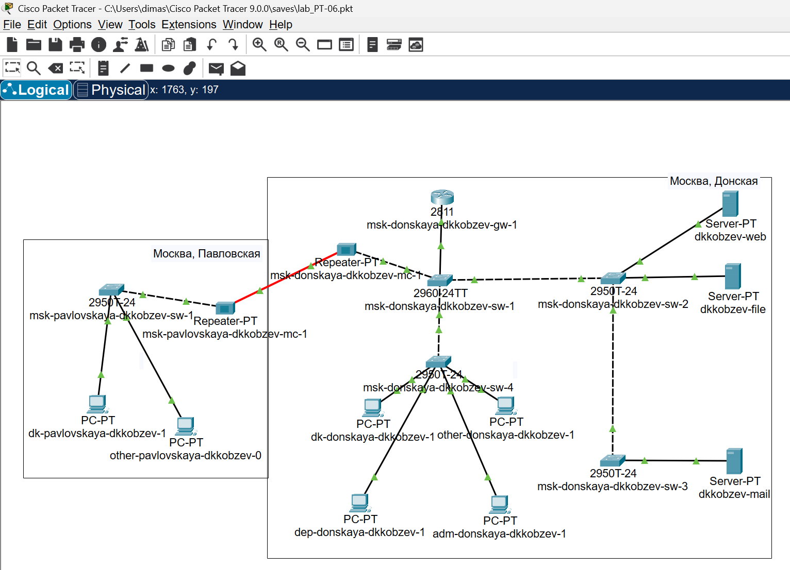{height=60%}

## Учёт физических параметров сети

Убеждаемся в работоспособности соединения между msk-donskaya-sw-1 и msk-pavlovskaya-sw-1 (Рис. 1.13).

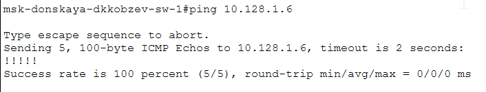{height=60%}

## Выводы

В результате выполнения лабораторной работы мною были получены навыки работы с физической рабочей областью Packet Tracer, с учетом физических параметров сети.