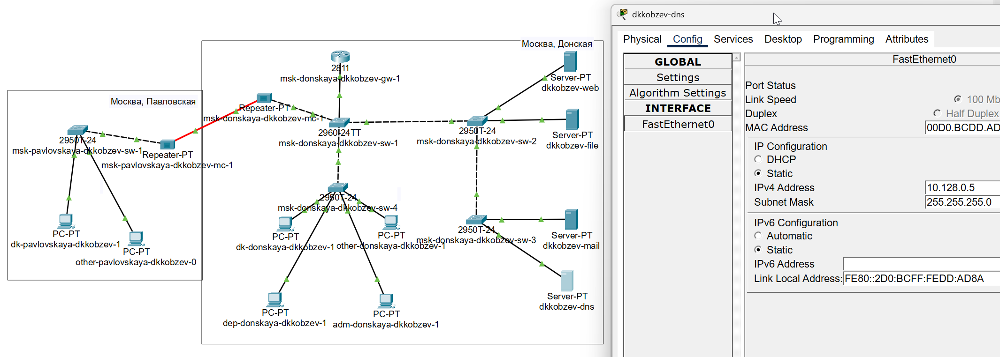
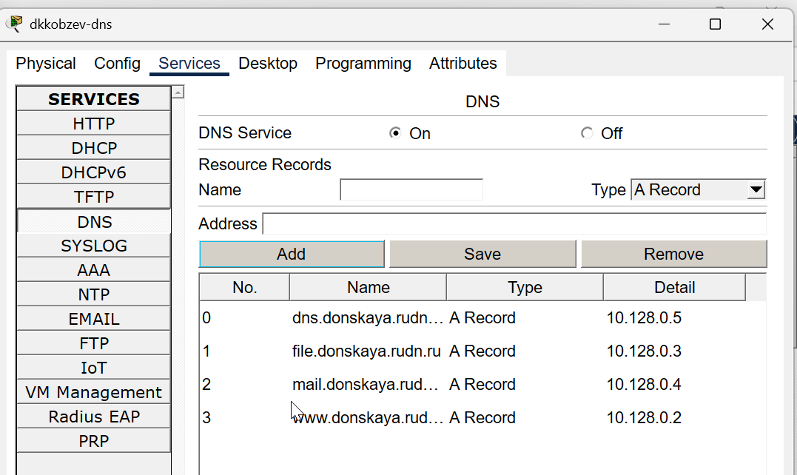
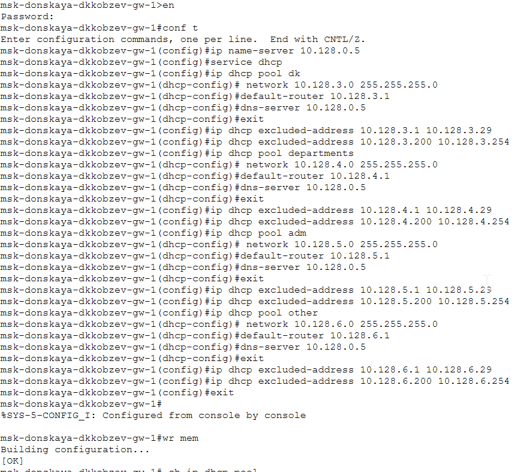
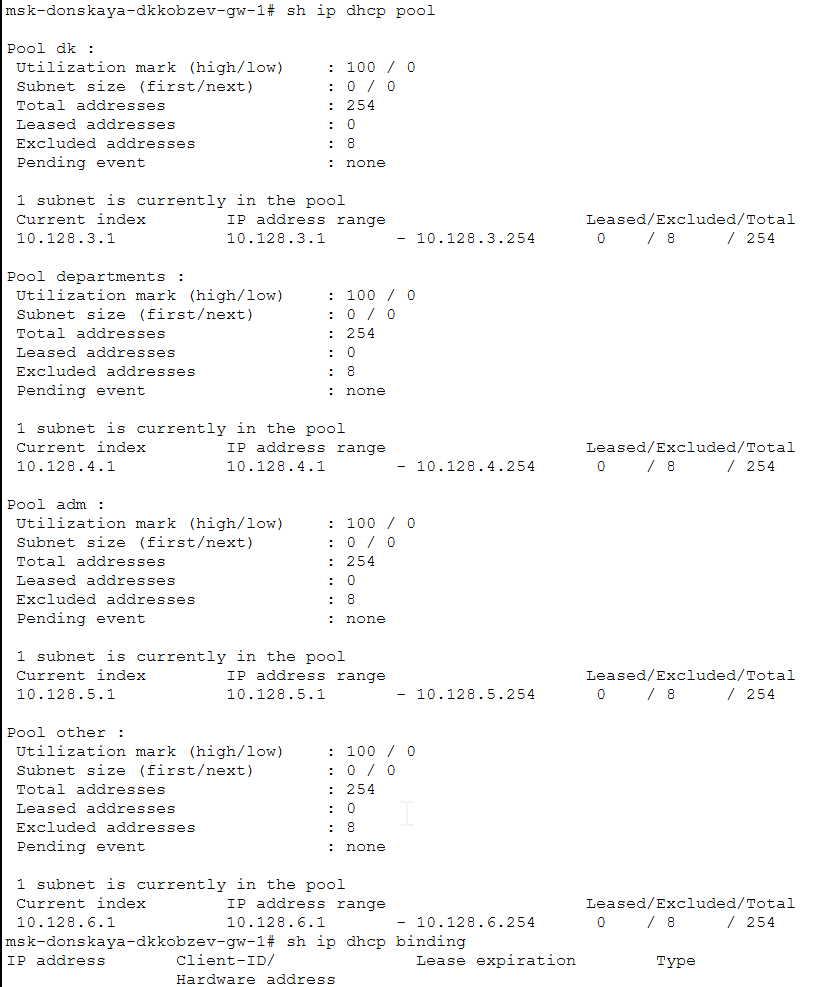
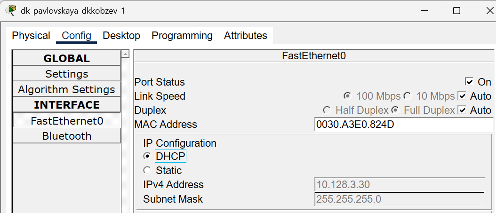
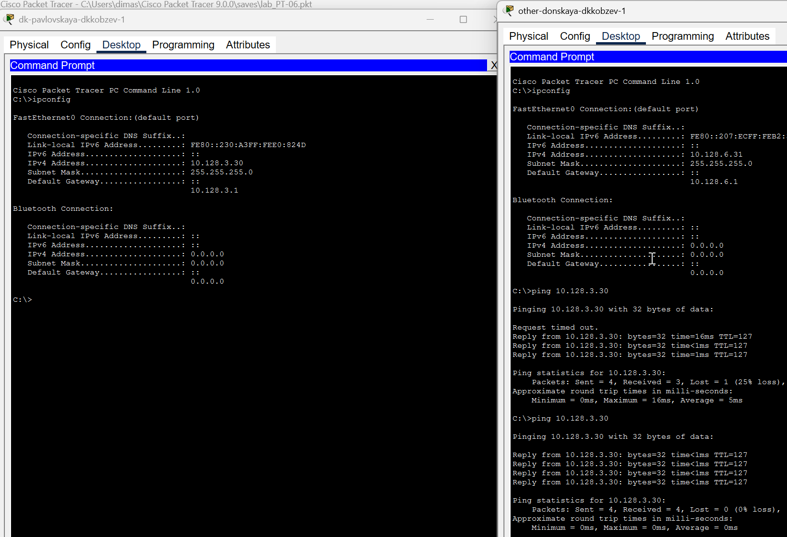

---
## Front matter
lang: ru-RU
title: Лабораторная работа
subtitle: Номер 8
author:
  - Кобзев Д. К. 
institute:
  - Российский университет дружбы народов, Москва, Россия
date: 4 апреля 2026

## i18n babel
babel-lang: russian
babel-otherlangs: english

## Pdf output format
fontsize: 8pt

## Formatting pdf
toc: false
toc-title: Содержание
slide_level: 2
aspectratio: 169
section-titles: true
theme: metropolis
##Fonts
mainfont: Liberation Serif
sansfont: Liberation Sans
monofont: Liberation Mono
---

# Информация

## Докладчик

:::::::::::::: {.columns align=center}
::: {.column width="70%"}

  * Кобзев Дмитрий Константинович
  * Студент
  * Российский университет дружбы народов
  * НПИбд-01-23

:::
::: {.column width="30%"}

:::
::::::::::::::

## Цель работы

Целью данной работы является приобретение практических навыков по настройке динамического распределения IP-адресов посредством протокола DHCP (Dynamic Host Configuration Protocol) в локальной сети.

## Настройка сетевых сервисов. DHCP

В логическую рабочую область проекта добавляем сервер dns и подключаем его к коммутатору msk-donskaya-sw-3 через порт Fa0/2, не забыв активировать порт при помощи соответствующих команд на коммутаторе. В конфигурации сервера указываем в качестве адреса шлюза 10.128.0.1, а в качестве адреса самого сервера — 10.128.0.5 с соответствующей маской 255.255.255.0 (Рис. 1.1).

{height=60%}

## Настройка сетевых сервисов. DHCP

Настраиваем сервис DNS: (рис. 8.2):
– в конфигурации сервера выбираем службу DNS, активируйте ее;
– в поле Type в качестве типа записи DNS выбираем записи типа A;
– в поле Name указываем доменное имя, по которому можно обратиться, например, к web-серверу — www.donskaya.rudn.ru, затем указываем его IP-адрес в соответствующем поле 10.128.0.2;
– нажав на кнопку Add , добавляем DNS-запись на сервер;
– аналогичным образом добавляем DNS-записи для серверов mail, file, dns согласно распределению адресов (Рис. 1.2).

{height=60%}

## Настройка сетевых сервисов. DHCP

Настраиваем DHCP-сервис на маршрутизаторе, используя приведённые команды для каждой выделенной сети: указываем IP-адрес DNS-сервера; затем переходим к настройке DHCP; задаем название конфигурируемому диапазону адресов (пулу адресов), указываем адрес сети, а также адреса шлюза и DNS-сервера; задаем пулы адресов, исключаемых из динамического распределени (Рис. 1.3).

{height=60%}

## Настройка сетевых сервисов. DHCP

{height=60%}

## Настройка сетевых сервисов. DHCP

На оконечных устройствах заменяем в настройках статическое распределение адресов на динамическое (Рис. 1.5).

{height=60%}

## Настройка сетевых сервисов. DHCP

Проверяем, какие адреса выделяются оконечным устройствам, а также доступность устройств из разных подсетей (Рис. 1.6).

{height=60%}

## Выводы

В результате выполнения лабораторной работы мною были приобретены практические навыки по настройке динамического распределения IP-адресов посредством протокола DHCP (Dynamic Host Configuration Protocol) в локальной сети.