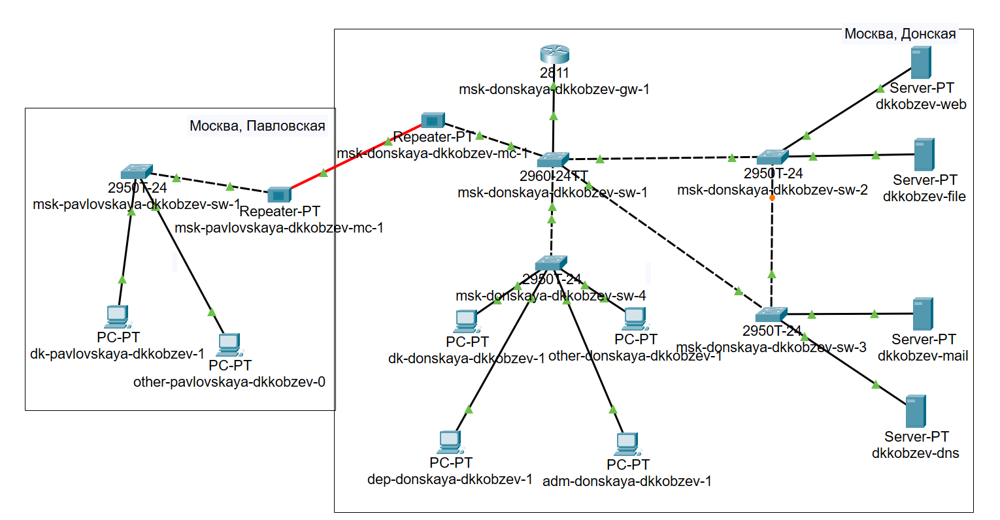
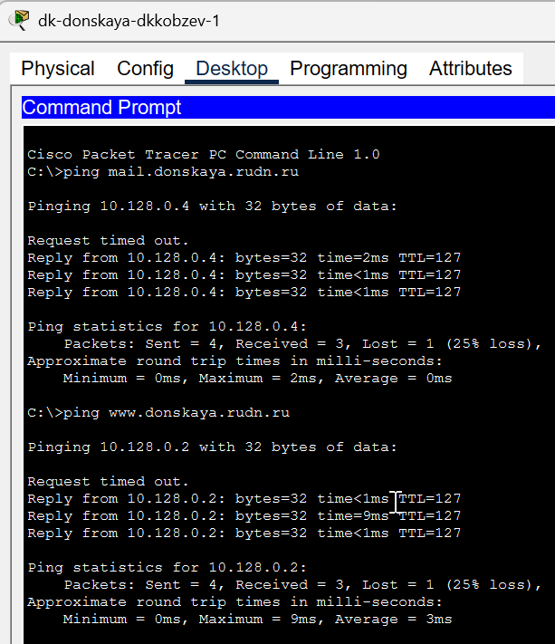
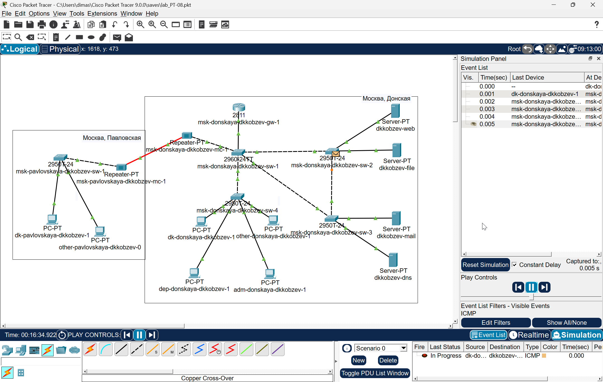
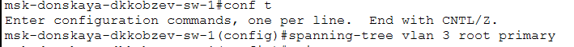
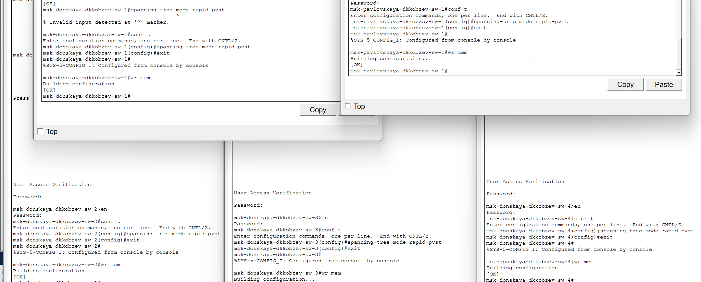
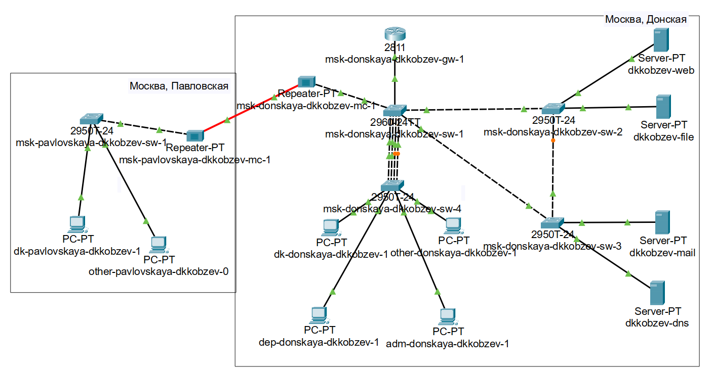

---
## Front matter
lang: ru-RU
title: Лабораторная работа
subtitle: Номер 9
author:
  - Кобзев Д. К. 
institute:
  - Российский университет дружбы народов, Москва, Россия
date: 18 июня 2026

## i18n babel
babel-lang: russian
babel-otherlangs: english

## Pdf output format
fontsize: 8pt

## Formatting pdf
toc: false
toc-title: Содержание
slide_level: 2
aspectratio: 169
section-titles: true
theme: metropolis
##Fonts
mainfont: Liberation Serif
sansfont: Liberation Sans
monofont: Liberation Mono
---

# Информация

## Докладчик

:::::::::::::: {.columns align=center}
::: {.column width="70%"}

  * Кобзев Дмитрий Константинович
  * Студент
  * Российский университет дружбы народов
  * НПИбд-01-23

:::
::: {.column width="30%"}

:::
::::::::::::::

## Цель работы

Целью данной работы является изучение возможностей протокола STP и его модификаций по обеспечению отказоустойчивости сети, агрегированию интерфейсов и перераспределению
нагрузки между ними.

## Использование протокола STP. Агрегирование каналов

Формируем резервное соединение между коммутаторами msk-donskaya-sw-1 и msk-donskaya-sw-3 (Рис. 1.1).

{height=60%}

## Использование протокола STP. Агрегирование каналов

С оконечного устройства dk-donskaya-1 пингуем серверы mail и web. В режиме симуляции следим за движением пакетов ICMP. Убеждаеся, что движение пакетов происходит через коммутатор msk-donskaya-sw-2 (Рис. 1.2), (Рис. 1.3).

{height=60%}

## Использование протокола STP. Агрегирование каналов

{height=60%}

## Использование протокола STP. Агрегирование каналов

На коммутаторе msk-donskaya-sw-2 смотрим состояние протокола STP для vlan 3 (Рис. 1.4).

{height=60%}

## Использование протокола STP. Агрегирование каналов

В качестве корневого коммутатора STP настраиваем коммутатор msk-donskaya-sw-1 (Рис. 1.5).

{height=60%}

## Использование протокола STP. Агрегирование каналов

Настраиваем режим Portfast на тех интерфейсах коммутаторов, к которым подключены серверы (Рис. 1.6).

{height=60%}

## Использование протокола STP. Агрегирование каналов

Изучаем отказоустойчивость протокола STP и время восстановления соединения при переключении на резервное соединение. Для этого используем команду ping -n 1000 mail.donskaya.rudn.ru на хосте dk-donskaya-1, а разрыв соединения обеспечиваем переводом соответствующего интерфейса коммутатора в состояние shutdown (Рис. 1.7).

{height=60%}

## Использование протокола STP. Агрегирование каналов

Переключаем коммутаторы режим работы по протоколу Rapid PVST+ (Рис. 1.8).

{height=60%}

## Использование протокола STP. Агрегирование каналов

Изучаем отказоустойчивость протокола Rapid PVST+ и время восстановления соединения при переключении на резервное соединение (Рис. 1.9).

{height=60%}

## Использование протокола STP. Агрегирование каналов

Формируем агрегированное соединение интерфейсов Fa0/20 – Fa0/23 между коммутаторами msk-donskaya-sw-1 и msk-donskaya-sw-4 (Рис. 1.10).

{height=60%}

## Использование протокола STP. Агрегирование каналов

Настраиваем агрегирование каналов (режим EtherChannel) (Рис. 1.11).

{height=60%}

## Выводы

В результате выполнения лабораторной работы мною были изучены возможности протокола STP и его модификаций по обеспечению отказоустойчивости сети, агрегированию интерфейсов и перераспределению нагрузки между ними.