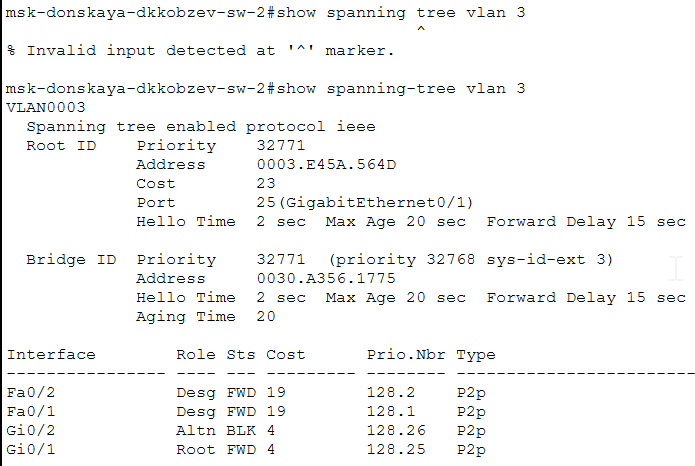
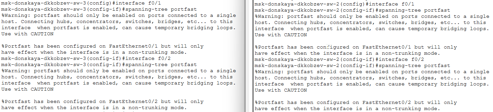
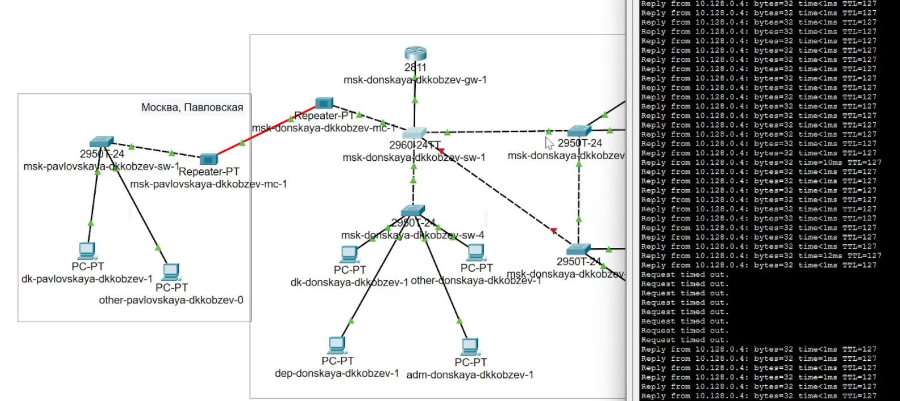
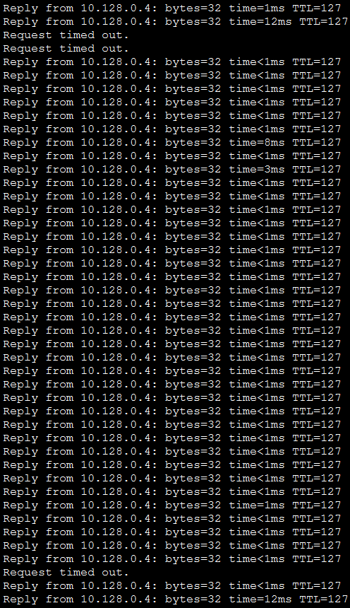
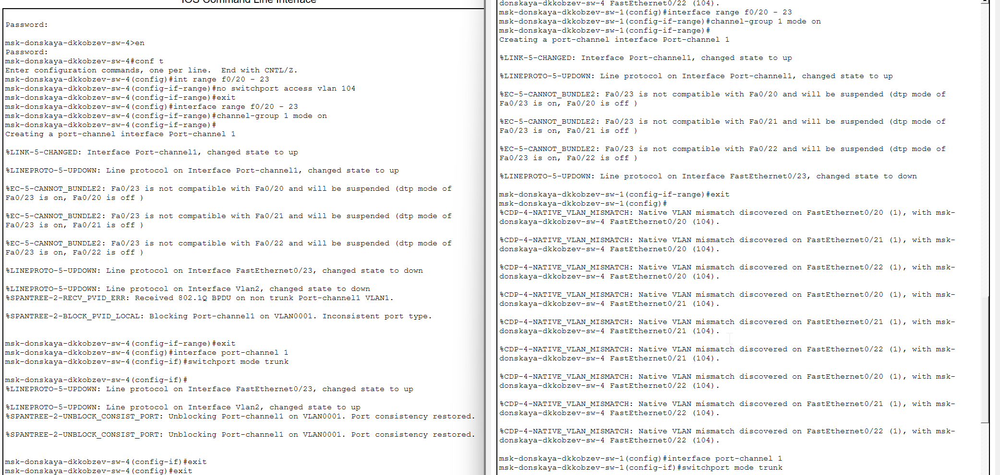

---
## Front matter
title: Лабораторная работа
subtitle: Номер 9
author: "Кобзев Д. К."

## Generic otions
lang: ru-RU
toc-title: "Содержание"

## Bibliography
bibliography: bib/cite.bib
csl: /home/dkkobzev/pandoc/csl/gost-r-7-0-5-2008-numeric.csl

## Pdf output format
toc: true # Table of contents
toc-depth: 2
lof: true # List of figures
lot: true # List of tables
fontsize: 12pt
linestretch: 1.5
papersize: a4
documentclass: scrreprt
## I18n polyglossia
polyglossia-lang:
  name: russian
  options:
    - spelling=modern
    - babelshorthands=true
polyglossia-otherlangs:
  name: english
## I18n babel
babel-lang: russian
babel-otherlangs: english
## Fonts
mainfont: Liberation Serif
romanfont: Liberation Serif
sansfont: Liberation Sans
monofont: Liberation Mono
# mathfont: Libertinus Math
mainfontoptions: Ligatures=Common,Ligatures=TeX,Scale=0.94
romanfontoptions: Ligatures=Common,Ligatures=TeX,Scale=0.94
sansfontoptions: Ligatures=Common,Ligatures=TeX,Scale=MatchLowercase,Scale=0.94
monofontoptions: Scale=MatchLowercase,Scale=0.94,FakeStretch=0.9

## Pandoc-crossref LaTeX customization
figureTitle: "Рис."
tableTitle: "Таблица"
listingTitle: "Листинг"
lofTitle: "Список иллюстраций"
lotTitle: "Список таблиц"
lolTitle: "Листинги"
## Misc options
indent: true
header-includes:
  - \usepackage{indentfirst}
  - \usepackage{float} # keep figures where there are in the text
  - \floatplacement{figure}{H} # keep figures where there are in the text
---

# Цель работы

Целью данной работы является изучение возможностей протокола STP и его модификаций по обеспечению отказоустойчивости сети, агрегированию интерфейсов и перераспределению
нагрузки между ними.

# Выполнение лабораторной работы

Формируем резервное соединение между коммутаторами msk-donskaya-sw-1 и msk-donskaya-sw-3 (Рис. 1.1).

{height=60%}

С оконечного устройства dk-donskaya-1 пингуем серверы mail и web. В режиме симуляции следим за движением пакетов ICMP. Убеждаеся, что движение пакетов происходит через коммутатор msk-donskaya-sw-2 (Рис. 1.2), (Рис. 1.3).

{height=60%}

{height=60%}

На коммутаторе msk-donskaya-sw-2 смотрим состояние протокола STP для vlan 3 (Рис. 1.4).

{height=60%}

В качестве корневого коммутатора STP настраиваем коммутатор msk-donskaya-sw-1 (Рис. 1.5).

{height=60%}

Настраиваем режим Portfast на тех интерфейсах коммутаторов, к которым подключены серверы (Рис. 1.6).

{height=60%}

Изучаем отказоустойчивость протокола STP и время восстановления соединения при переключении на резервное соединение. Для этого используем команду ping -n 1000 mail.donskaya.rudn.ru на хосте dk-donskaya-1, а разрыв соединения обеспечиваем переводом соответствующего интерфейса коммутатора в состояние shutdown (Рис. 1.7).

{height=60%}

Переключаем коммутаторы режим работы по протоколу Rapid PVST+ (Рис. 1.8).

{height=60%}

Изучаем отказоустойчивость протокола Rapid PVST+ и время восстановления соединения при переключении на резервное соединение (Рис. 1.9).

{height=60%}

Формируем агрегированное соединение интерфейсов Fa0/20 – Fa0/23 между коммутаторами msk-donskaya-sw-1 и msk-donskaya-sw-4 (Рис. 1.10).

{height=60%}

Настраиваем агрегирование каналов (режим EtherChannel) (Рис. 1.11).

{height=60%}

# Выводы

В результате выполнения лабораторной работы мною были изучены возможности протокола STP и его модификаций по обеспечению отказоустойчивости сети, агрегированию интерфейсов и перераспределению нагрузки между ними.

# Список литературы{.unnumbered}
